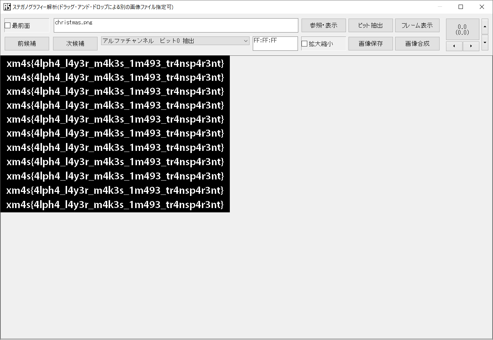

# magic_mirror:Misc:94pts
マジックミラーは，光の特性によって，暗い側から明るい側のみ見ることができるものです． 私たちはその研究をしている間に，一枚の写真を入手しました． 写真を様々な側から見て，隠された情報を導きましょう．  
[christmas.png](christmas.png)  

# Solution
christmas.pngなる画像が配布される。  
問題文がマジックミラーについて言及しているので、アルファチャンネルに何かありそうだ。  
[うさみみハリケーン](https://www.vector.co.jp/soft/win95/prog/se375830.html)付属の青空白猫で解析を行う。  
  
アルファチャンネルビット0を抽出するとflagが表示された。  

## xm4s{4lph4_l4y3r_m4k3s_1m493_tr4nsp4r3nt}