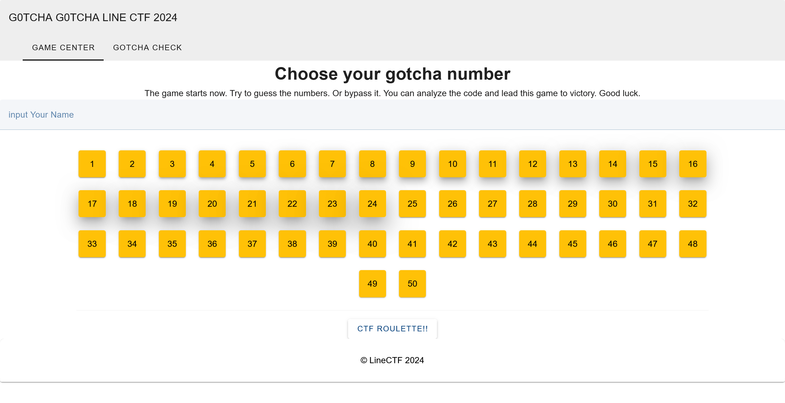
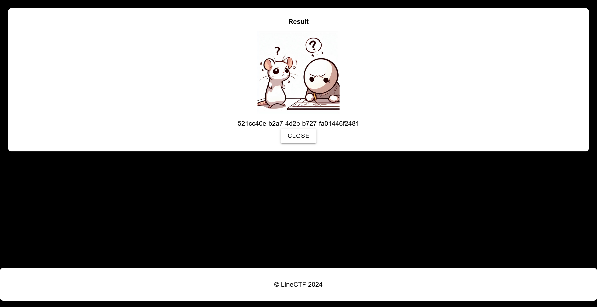

# G0tcha-G0tcha-doggy:Web:124pts
Please enjoy. if you have a problem when you solve this challenge. Please contact wulfsek.  
server:1 [http://35.243.76.165:11008/](http://35.243.76.165:11008/)  
server:2 [http://34.85.97.250:11008/](http://34.85.97.250:11008/)  

[g0tcha-g0tcha-doggy_e759acb5f467e056a4ea790a011d9f98.zip](g0tcha-g0tcha-doggy_e759acb5f467e056a4ea790a011d9f98.zip)  

# Solution
URLとソースが配布される。  
アクセスすると謎の数当てゲーム？のようだ。  
  
  
以下のようにKotlinのかなり大規模なソース群で読みたくない。  
```bash
$ tree
.
├── Dockerfile
├── README.md
├── build.gradle
├── docker-compose copy.yaml
├── gradle
│   └── wrapper
│       ├── gradle-wrapper.jar
│       └── gradle-wrapper.properties
├── gradlew
├── gradlew.bat
├── nginx
│   ├── Dockerfile
│   ├── default.conf
│   ├── log
│   └── nginx.conf
├── settings.gradle
└── src
    ├── main
    │   ├── kotlin
    │   │   └── com
    │   │       └── linectf2024
    │   │           └── g0tchag0tchadoggy
    │   │               ├── G0tchaG0tchaDoggyApplication.kt
    │   │               ├── config
    │   │               │   ├── ScriptEngineConfiguration.kt
    │   │               │   └── SecurityConfig.kt
    │   │               ├── controller
    │   │               │   └── GotchaController.kt
    │   │               ├── dto
    │   │               │   ├── Mapper.kt
    │   │               │   ├── Request.kt
    │   │               │   └── Response.kt
    │   │               ├── exception
    │   │               │   ├── CustomException.kt
    │   │               │   └── GlobalExceptionHandler.kt
    │   │               ├── model
    │   │               │   └── GotchaEntity.kt
    │   │               ├── repository
    │   │               │   └── GotchaRepository.kt
    │   │               ├── service
    │   │               │   ├── GotchaScriptEngineService.kt
    │   │               │   └── GotchaService.kt
    │   │               └── util
    │   │                   └── GotchaValidator.kt
    │   └── resources
    │       ├── application.properties
    │       └── static
    │           ├── assets
    │           │   ├── CheckGotcha.c25d76aa.js
    │           │   ├── gatchafail.f9b0967b.jpeg
    │           │   ├── gotchamade.be099332.jpg
    │           │   ├── index.1382d43e.css
    │           │   ├── index.694517c7.js
    │           │   ├── materialdesignicons-webfont.8bded8f4.woff
    │           │   ├── materialdesignicons-webfont.9bdfaf27.eot
    │           │   ├── materialdesignicons-webfont.c14484cf.ttf
    │           │   ├── materialdesignicons-webfont.da7fba3c.woff2
    │           │   └── webfontloader.b777d690.js
    │           ├── favicon.ico
    │           ├── images
    │           │   └── flag.jpg
    │           └── index.html
    └── test
        └── kotlin
            └── com
                └── linectf2024
                    └── g0tchag0tchadoggy
                        └── G0tchaG0tchaDoggyApplicationTests.kt

27 directories, 41 files
```
ひとまずフラグが置かれているパス`http://35.243.76.165:11008/images/flag.jpg`にアクセスしてみる。  
  
flagが表示されてしまった(作問ミスだと思われる)。  

## LINECTF{1c817e624ca6e4875e1a876aaf3466fc}