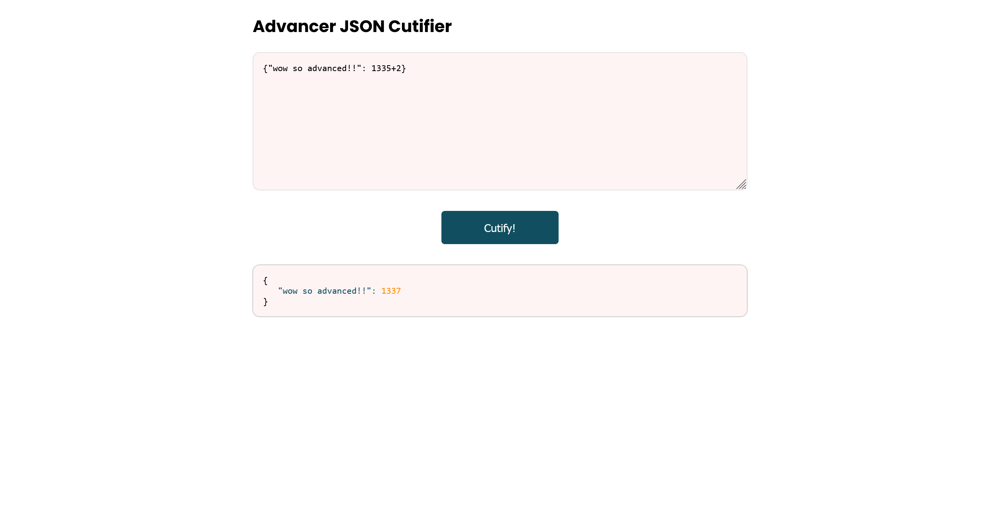
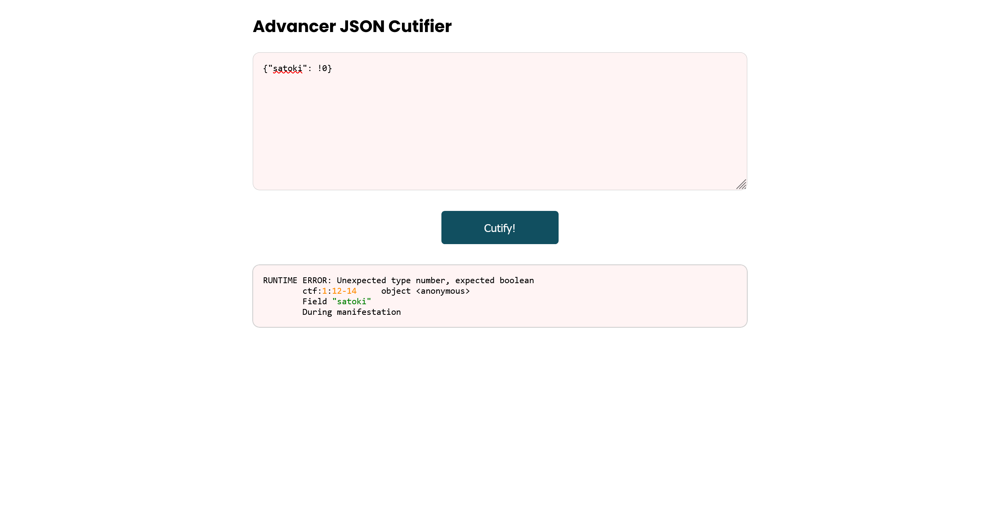
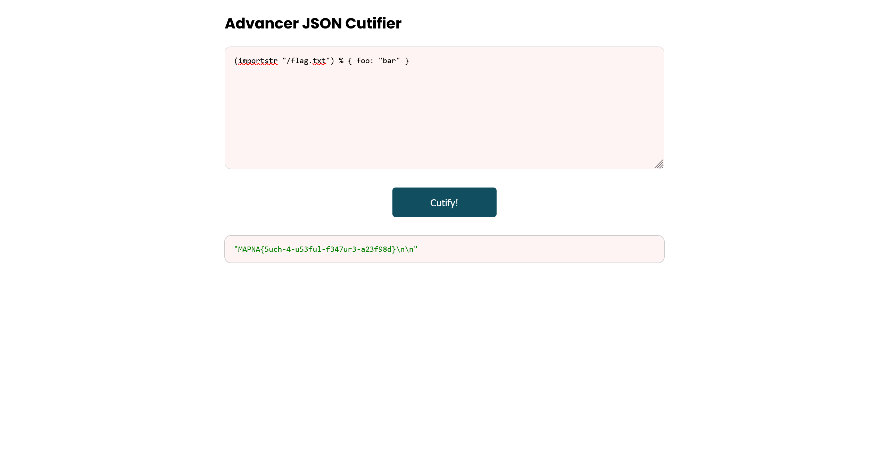

# Advanced JSON Cutifier:Web:59pts
My homework was to write a JSON beautifier. Just Indenting JSON files was too boring that's why I decided to add some features to my project using a popular (More than 1k stars on GitHub!! ) library to make my project more exciting.  
**Important: You can't read any file other than `/flag.txt` on the remote environment.**  
[Attachment](player_a466f9f2a43ac42473015d72342c262e8d4b9519.txz)  
```
http://3.64.250.135:8005
```

# Solution
URLとソースが配布される。  
アクセスするとJSONを良くしてくれるらしい。  
  
通常は考えられない和が計算されている。  
ソースを見ると以下のようでライブラリを非公開にしている。  
```go
package main

import (
    "net/http"
    "github.com/gin-gonic/gin"
    "github.com/REDACTED/REDACTED"
)

func main() {
    router := gin.Default()
    router.StaticFile("/", "./index.html")
    router.POST("/parse", parse)
    router.Run("0.0.0.0:8080")
}

func parse(c *gin.Context) {
    buf ,err := c.GetRawData()
    if(err != nil){
        c.IndentedJSON(http.StatusBadRequest, err.Error())
        return
    }
    jsonStr, err := REDACTED.REDACTED().REDACTED("ctf", string(buf[:]))
    if err != nil {
        c.IndentedJSON(http.StatusInternalServerError, err.Error())
        return
    }
    c.IndentedJSON(http.StatusOK, jsonStr)
}
```
問題文から`/flag.txt`を読み込まなければいけないが、ライブラリ固有の機能がありそうなため調査する。  
否定が可能であるのか試しに`{"satoki": !0}`を入力すると以下のエラーが表示された。  
  
特徴的な出力であるので、エラーをもとに調査していく。  
「go-lang json "During manifestation"」とGoogle検索すると[go-jsonnet](https://github.com/google/go-jsonnet/blob/master/interpreter.go)がヒットした。  
1k以上のstarsがあり、サンプルもそっくりである。  
さらにファイルを読み込めないか調査する。  
「go-jsonnet file read」とGoogle検索すると[GitHubのIssue](https://github.com/google/jsonnet/issues/238)がヒットした。  
`(importstr "myfile.txt") % { foo: "bar" }`でファイルが読めると書いてある。  
ファイル名を書き換え、実行する。  
  
ファイルが読み取れ、flagが得られた。  

## MAPNA{5uch-4-u53ful-f347ur3-a23f98d}