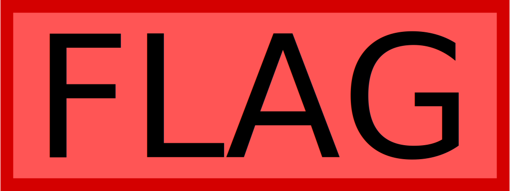
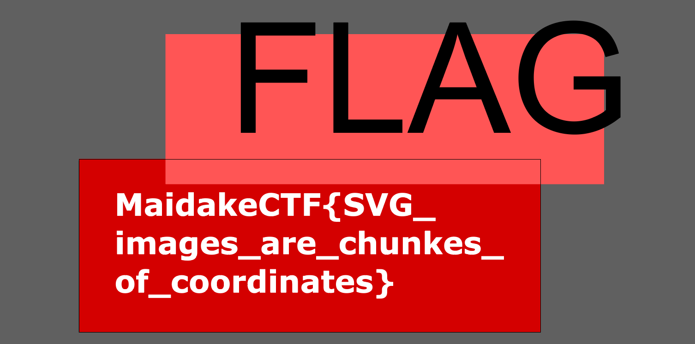

# SVG 2nd:Misc:200pts
もう少しちゃんと隠しました。 [https://aokakes.work/MaidakeCTF2020/SVG2/](https://aokakes.work/MaidakeCTF2020/SVG2/)  
Hint  
SVGはただの図形や文字列が重なっているだけなんです。  

# Solution
URLにアクセスすると以下のようなサイトだった。  
SVG 2nd  
[site.png](site/site.png)  
svgのみが置かれている。  
  
中身には直接書かれていないようだ。  
Illustratorでいじっているとflagが現れた。  
  

## MaidakeCTF{SVG_images_are_chunkes_of_coordinates}