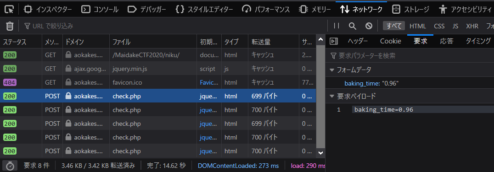

# 焼肉W:Misc:200pts
肉焼きに自信はありますか？ [https://aokakes.work/MaidakeCTF2020/niku/](https://aokakes.work/MaidakeCTF2020/niku/)  
Hint  
ソースコードを見てググるのです...  

# Solution
URLにアクセスすると肉を焼けるようだ。  
焼肉W  
[site.png](site/site.png)  
焼き上げるごとに焼き時間をcheck.phpにPOSTしているようだ。  
  
モンハンが思い浮かぶが、曲に合わせて焼いても無駄であった。  
curlでちょうどの秒数を試してみる。  
```bash
$ curl -X POST -d "baking_time=0" https://aokakes.work/MaidakeCTF2020/niku/check.php
$ curl -X POST -d "baking_time=1" https://aokakes.work/MaidakeCTF2020/niku/check.php
$ curl -X POST -d "baking_time=2" https://aokakes.work/MaidakeCTF2020/niku/check.php
$ curl -X POST -d "baking_time=3" https://aokakes.work/MaidakeCTF2020/niku/check.php
$ curl -X POST -d "baking_time=4" https://aokakes.work/MaidakeCTF2020/niku/check.php
$ curl -X POST -d "baking_time=5" https://aokakes.work/MaidakeCTF2020/niku/check.php
MaidakeCTF{I_want_to_try_Monster_Hunter's_Well-done_Steak}
$ curl -X POST -d "baking_time=6" https://aokakes.work/MaidakeCTF2020/niku/check.php
$ curl -X POST -d "baking_time=7" https://aokakes.work/MaidakeCTF2020/niku/check.php
$ curl -X POST -d "baking_time=8" https://aokakes.work/MaidakeCTF2020/niku/check.php
$ curl -X POST -d "baking_time=9" https://aokakes.work/MaidakeCTF2020/niku/check.php
$ curl -X POST -d "baking_time=10" https://aokakes.work/MaidakeCTF2020/niku/check.php
```
5sでflagが返ってきた。  

## MaidakeCTF{I_want_to_try_Monster_Hunter's_Well-done_Steak}