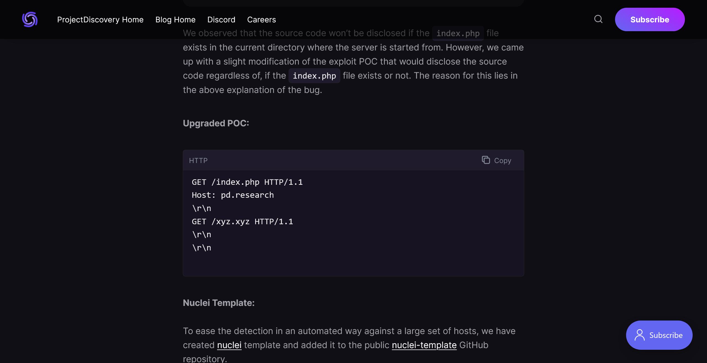
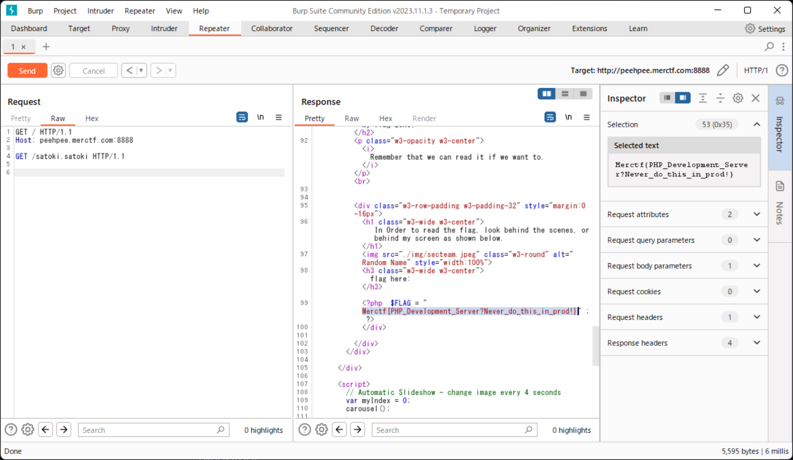

# Old Ver ?:MerCTF:450pts
AI is really nice and powerful! I found this website talking about it, but I think they should secure their website before bragging about AI  
**URL:** [http://peehpee.merctf.com:8888/](http://peehpee.merctf.com:8888/)  

[ToGive.zip](ToGive.zip)  

# Solution
URLとソースが配布される。  
アクセスするとほとんど静的なサイトのようだ。  
  
ソースを見るとindex.phpに以下のような箇所があった。  
```php
~~~
  <!-- The Tour Section -->
  <div class="w3-black" id="flag">
    <div class="w3-container w3-content w3-padding-64" style="max-width:800px">
      <h2 class="w3-wide w3-center">My flag zone!</h2>
      <p class="w3-opacity w3-center"><i>Remember that we can read it if we want to.</i></p><br>


      <div class="w3-row-padding w3-padding-32" style="margin:0 -16px">
        <h1 class="w3-wide w3-center"> In Order to read the flag, look behind the scenes, or behind my screen as shown below. </h1>
        
        <h3 class="w3-wide w3-center">flag here: </h3> 
        <?php  $FLAG = "Merctf{FAKE_FLAG}" ; ?>
      </div>

    </div>
  </div>
~~~
```
`$FLAG`にフラグを代入しているが、それを表示する箇所はない。  
つまり何らかの手法でphpファイルをそのまま読みだしてやる必要がある。  
ここで問題名から古いサーバを使っていると推測できる。  
```bash
$ curl 'http://peehpee.merctf.com:8888/' -I
HTTP/1.1 200 OK
Host: peehpee.merctf.com:8888
Date: Wed, 27 Dec 2023 14:22:05 GMT
Connection: close
X-Powered-By: PHP/7.4.21
Content-type: text/html; charset=UTF-8

```
`PHP/7.4.21`のようなので、「PHP 7.4.21 exploit」とGoogle検索する。  
すると[PHP Development Server <= 7.4.21 - Remote Source Disclosure](https://blog.projectdiscovery.io/php-http-server-source-disclosure/)なる記事が見つかる。  
Development Serverである場合にソースが漏洩するようだ。  
配布されたソースのDockerfileは以下のようであった。  
```Dockerfile
FROM php:7.4.21-zts-buster
COPY . /var/www/html/
CMD ["php", "-S", "0.0.0.0:8888", "-t", "/var/www/html/"]
```
Development Serverだ。  
サイトに書かれていたPoCを試す。  
  
Burp Suiteで送信する(設定のUpdate content lengthをoffにする)。  
  
ソースが取得でき、flagが含まれていた。  

## Merctf{PHP_Development_Server?Never_do_this_in_prod!}