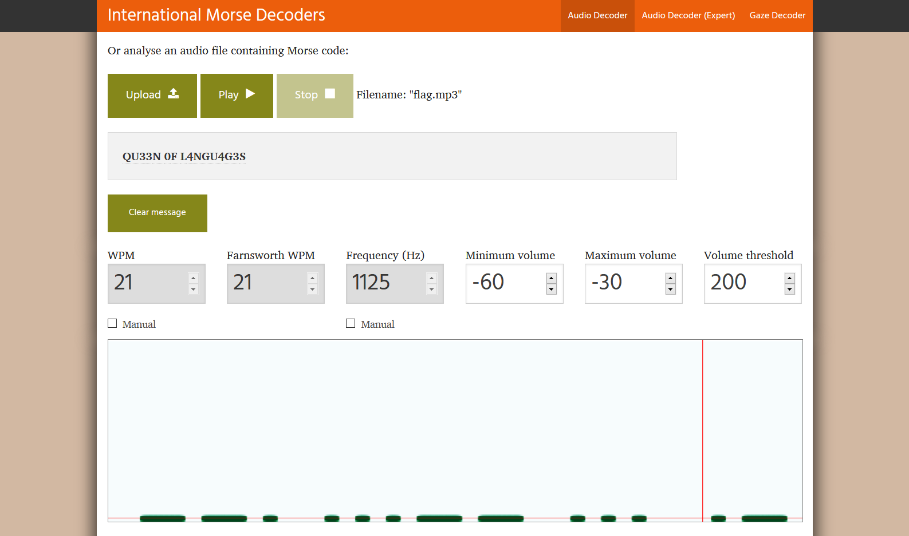

# Secret Message:Forensics:100pts
Monica loves inventing secret languages. So much so that she claims to be the only one to know the message in this recording. What does it say?  
Hint  
You shouldn't have to do this by hand, right?  
Hint  
Flags are in format nactf{x_y_z....} not nactf(x y z....)  
[flag.mp3](flag.mp3)  

# Solution
mp3が渡される。  
聞いてみるとどうやらモールス信号のようだ。  
「morse code mp3 to text」などで検索すると[Morse Code Adaptive Audio Decoder](https://morsecode.world/international/decoder/audio-decoder-adaptive.html)が見つかった。  
ここでデコードする。  
  
`QU33N 0F L4NGU4G3S`とデコードされるので、フォーマット通りに整形する。  

## nactf{QU33N_0F_L4NGU4G3S}