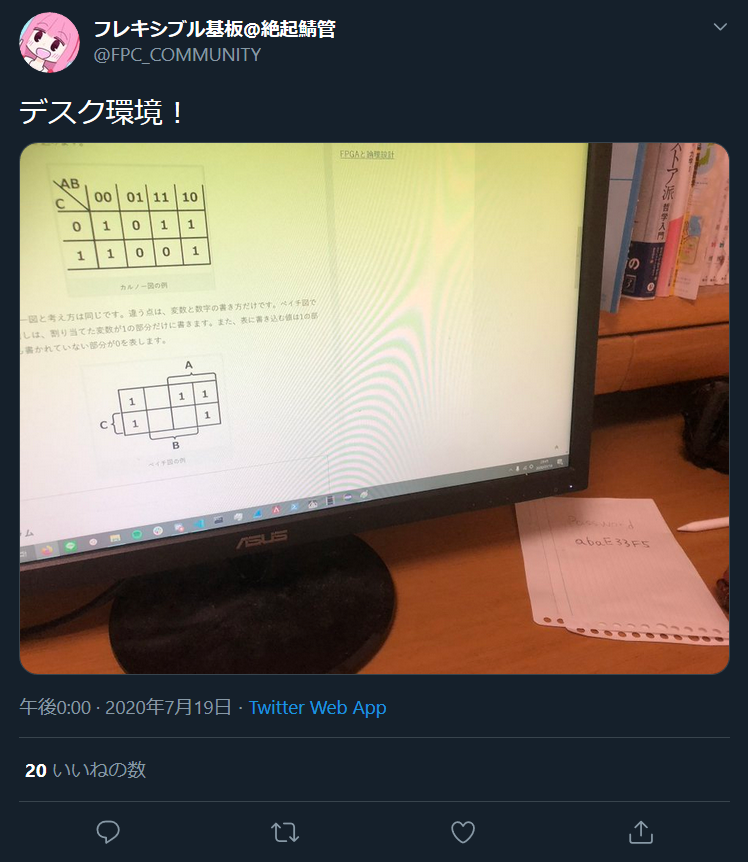
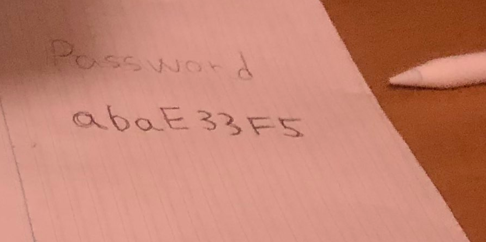

# Dangerous Twitter:Recon:100pts
フレキ君はパスワードの管理がなってないようです。  
どうやらフレキ君はあるサイトへのログインパスワードを漏らしてしまったみたい。  
フレキ君のTwitterアカウントからそのパスワードを特定しましょう。  
フラグはnitic_ctf{特定したパスワード}になります。  
[https://twitter.com/FPC_COMMUNITY](https://twitter.com/FPC_COMMUNITY)  

# Solution
Twitterに飛ぶと、明らかに問題のためにしたであろう奇妙なツイートを発見する。  
  
その画像の中にPasswordが書かれていた。  
  

## nitic_ctf{abaE33F5}