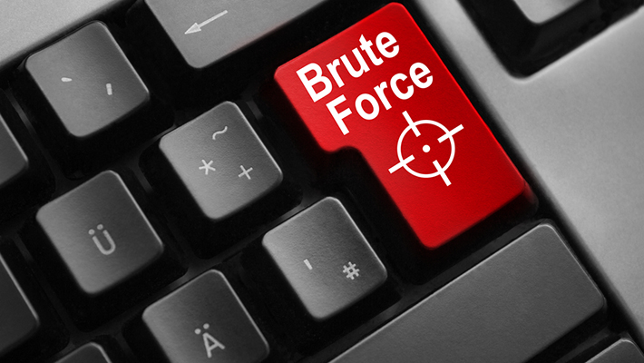

# Case loss:Cryptography:500pts
can you help me brute force the case on this base 64 encoded string in order to help me find the secret message?  
Ciphertext: t0zqufqtq1rge2jsvxqzzjbyqzfur19iyvmznjrfmvnfm2ftex0  
  
Pouvez-vous convertir ce flag?  
Ciphertext: t0zqufqtq1rge2jsvxqzzjbyqzfur19iyvmznjrfmvnfm2ftex0  
Hint  
Try messing with the capitals of the base 64 encoded string and reconstruct the message  

# Solution
問題文の`t0zqufqtq1rge2jsvxqzzjbyqzfur19iyvmznjrfmvnfm2ftex0`はbase64エンコードしたフラグををすべて小文字化したもののようだ。  
総当たりすればよいが、人間は優秀なのでだいたい3文字ずつ適当に大文字小文字を変化させると読めるleet英文になる。  
`OFPPT-CTF{`が`T0ZQUFQtQ1RGew==`となることから、先頭も予測できる。  
```
t0zqufqtq1rge2jsvxqzzjbyqzfur19iyvmznjrfmvnfm2ftex0
T0ZQUFQtQ1RGe2JSVXQzZjByQzFuR19iYVMzNjRfMVNfM2FTeX0
```
のようにすると`OFPPT-CTF{bRUt3f0rC1nG_baS364_1S_3aSy}`とわかる。  
flagが得られた。  

## OFPPT-CTF{bRUt3f0rC1nG_baS364_1S_3aSy}