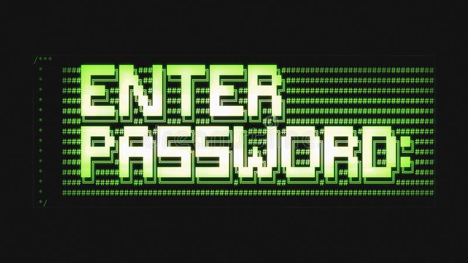

# Creds:Binary:300pts
Can you find the credentials (username and password) of the 'user' and 'pass' binaries respectively.  
Submit the flag with the format: OFPPT-CTF{username_password}.  
  
Pouvez-vous trouver les informations d'identification (nom d'utilisateur et mot de passe) des fichiers binaires 'user' et 'pass' respectivement.  
Soumettez le drapeau sous le format : OFPPT-CTF{username_password}.  
Hint  
This is a challenge from tryhackme.com binary section. Their website contain even writeups to follow! I highly recommend tryhackme.com  
[Creds.zip](Creds.zip)  

# Solution
各問題共通のパスワードでzipを解凍すると二つのELFが手に入る。  
`user`と`pass`なので各自を解析するようだ。  
まずは`user`からユーザ名をgdbにて解析する。  
```bash
$ gdb ./user
~~~
gdb-peda$ start
~~~
gdb-peda$ n
~~~
[-------------------------------------code-------------------------------------]
   0x555555555198 <main+35>:    mov    eax,0x0
   0x55555555519d <main+40>:    call   0x555555555060 <ptrace@plt>
   0x5555555551a2 <main+45>:    cmp    rax,0xffffffffffffffff
=> 0x5555555551a6 <main+49>:    jne    0x5555555551c3 <main+78>
   0x5555555551a8 <main+51>:    lea    rdi,[rip+0xe59]        # 0x555555556008
   0x5555555551af <main+58>:    mov    eax,0x0
   0x5555555551b4 <main+63>:    call   0x555555555040 <printf@plt>
   0x5555555551b9 <main+68>:    mov    edi,0x1
                                                              JUMP is NOT taken
~~~
```
しばらくするとデバッガ検知が働いている。  
`set $pc = 0x5555555551c3`でメインループに飛んでやる。  
```bash
gdb-peda$ set $pc = 0x5555555551c3
~~~
gdb-peda$ n
~~~
[----------------------------------registers-----------------------------------]
RAX: 0x45 ('E')
RBX: 0x555555555260 (<__libc_csu_init>: push   r15)
RCX: 0x41414141 ('AAAA')
RDX: 0x6b ('k')
RSI: 0x41414141 ('AAAA')
RDI: 0x7ffff7fad7f0 --> 0x0
RBP: 0x7fffffffe0e0 --> 0x0
RSP: 0x7fffffffe0c0 --> 0x7fffffffe1d8 --> 0x7fffffffe409 ("/user")
RIP: 0x55555555521c (<main+167>:        add    eax,0x8)
R8 : 0x7fffffffe0d3 ("AAAAAAAA")
R9 : 0x7c ('|')
R10: 0x7ffff7fef130 (pxor   xmm0,xmm0)
R11: 0x246
R12: 0x555555555090 (<_start>:  xor    ebp,ebp)
R13: 0x7fffffffe1d0 --> 0x1
R14: 0x0
R15: 0x0
EFLAGS: 0x202 (carry parity adjust zero sign trap INTERRUPT direction overflow)
[-------------------------------------code-------------------------------------]
   0x555555555211 <main+156>:   movzx  eax,BYTE PTR [rbp+rax*1-0xd]
   0x555555555216 <main+161>:   xor    eax,0x4
   0x555555555219 <main+164>:   movsx  eax,al
=> 0x55555555521c <main+167>:   add    eax,0x8
   0x55555555521f <main+170>:   cmp    edx,eax
   0x555555555221 <main+172>:   je     0x555555555239 <main+196>
   0x555555555223 <main+174>:   lea    rdi,[rip+0xe56]        # 0x555555556080
   0x55555555522a <main+181>:   call   0x555555555030 <puts@plt>
~~~
```
ユーザ名比較部分ではループ処理で何かと比較されており、`0x555555555221`にて`set $pc = 0x555555555239`などすると文字列`kym~humr`が得られる。  
`kym~humr`はユーザ名ではなく、何らかの計算結果のようだ。  
上のcode部分を見てやると`(char xor 0x04) add 0x08`と計算しているようだ。  
元の文字を下のように求めてやる。  
```bash
>>> import string
>>> def user(c:chr):
...     for a in string.printable:
...         if chr((ord(a) ^ 0x04) + 0x08) == c:
...             print(a)
...             break
...
>>> user('k')
g
>>> user('y')
u
>>> user('m')
a
>>> user('~')
r
>>> user('h')
d
>>> user('u')
i
>>> user('m')
a
>>> user('r')
n
```
ユーザ名は`guardian`のようだ。  
次にパスワードを`pass`から解析する。  
stringsなどで解析するとどうやらgoで作られているらしい。  
mainループを見てやる。  
```bash
$ gdb ./pass
~~~
gdb-peda$ b main.main
Breakpoint 1 at 0x4a52c0: file /binary_heaven/password.go, line 3.
gdb-peda$ r
~~~
gdb-peda$ disass main
Dump of assembler code for function main.main:
=> 0x00000000004a52c0 <+0>:     mov    rcx,QWORD PTR fs:0xfffffffffffffff8
~~
   0x00000000004a54ac <+492>:   mov    QWORD PTR [rsp+0x8],rax
   0x00000000004a54b1 <+497>:   mov    QWORD PTR [rsp+0x10],rcx
   0x00000000004a54b6 <+502>:   call   0x4022e0 <runtime.memequal>
   0x00000000004a54bb <+507>:   cmp    BYTE PTR [rsp+0x18],0x0
   0x00000000004a54c0 <+512>:   je     0x4a540a <main.main+330>
~~

```
組み込みの比較`runtime.memequal`が見えるので、ここでr2を用いて比較対象を追ってみる。  
```bash
$ r2 -d -A ./pass
~~~
[0x00464700]> pdf @sym.main.main
~~~
│   ╎╎└───> 0x004a54a1      48890424       mov qword [rsp], rax
│   ╎╎ │╎   0x004a54a5      488d055f5802.  lea rax, qword [0x004cad0b] ; "GOg0esGrrr!IdeographicMedefaidrinNandinagariNew_Tai_LueOld_PersianOld_SogdianPau_Cin_HauSignWritingSoft_DottedWarang_CitiWhite_"
│   ╎╎ │╎   0x004a54ac      4889442408     mov qword [var_b8h], rax
│   ╎╎ │╎   0x004a54b1      48894c2410     mov qword [var_b0h], rcx
│   ╎╎ │╎   0x004a54b6      e825cef5ff     call sym.runtime.memequal
~~~
```
パスワードは`GOg0esGrrr!`のようだ。  
これでユーザ名とパスワードが取得できたため確認する。  
```bash
$ ./user

Say my username >> guardian

Correct! That is my name!
$ ./pass

Say the magic word >>
GOg0esGrrr!

Right password! Now GO ahead and SSH into heaven.
```
指定された形式にユーザ名とパスワードを整形するとflagとなった。  

## OFPPT-CTF{guardian_GOg0esGrrr!}