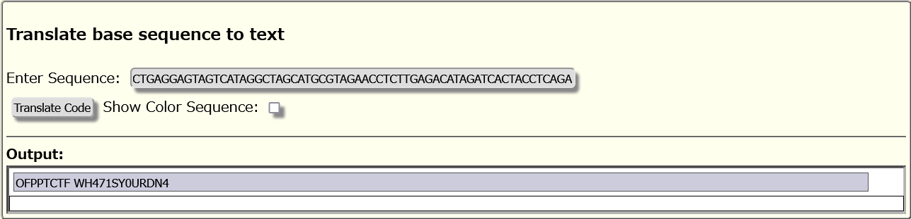

# DNA:Warmup:200pts
What is your DNA?  
TGTGCTGAGGAGTAGTCATAGGCTAGCATGCGTAGAACCTCTTGAGACATAGATCACTACCTCAGA  
  
Quelle est votre ADN?  
TGTGCTGAGGAGTAGTCATAGGCTAGCATGCGTAGAACCTCTTGAGACATAGATCACTACCTCAGA  
Hint  
The flag is missing some special characters, try to format the flag as: OFPPT-CTF{......}  
Hint  
[https://earthsciweb.org/js/bio/dna-writer/](https://earthsciweb.org/js/bio/dna-writer/)  

# Solution
DNAの塩基配列が渡される。  
暗号なようなので「CTF DNA Cryptography」で検索すると謎のオレオレ暗号が無限にある。  
どれを使っても駄目だが、検索には出てこないヒントの[DNA Writer](https://earthsciweb.org/js/bio/dna-writer/)を使う問題であった。  
ヒントありきはあまりにもカス問題。  
  
得られた文字列をヒントで指定された形式に整形するとflagとなった。  

## OFPPT-CTF{WH471SY0URDN4}