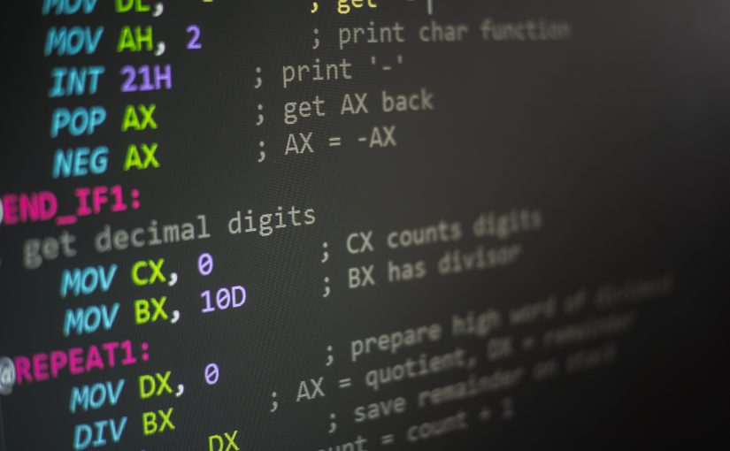
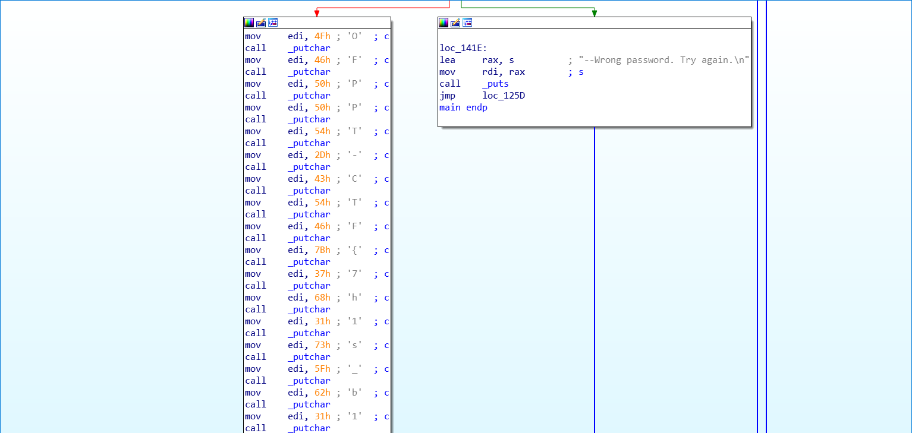

# EZBinary:Binary:250pts
Why is it always a password?  
  
Pourquoi est-ce toujours un mot de passe ?  
Hint  
Use ghidra or any prefered decompiler.  
[EZBinary.zip](EZBinary.zip)  

# Solution
パスワード付きzipが配布されるので、ほかの問題と同様の`0FPP7C7F`で解凍する。  
中にはELFが入っていたので、実行する。  
```bash
$ ./EZBinary
Enter password: Satoki
[matched value]:47
[matched value]:47
--Wrong password. Try again.

Enter password: password
[matched value]:76
[matched value]:76
--Wrong password. Try again.

Enter password:
```
パスワードを解析するようだ。  
stringsでは見つからないので、IDAで開いてみる。  
  
一文字ずつ`OFPPT-CTF{7h1s_b1n4ry_1s_Vunl3r4bl3}`とベタ書きされていた。  
集めるとflagとなった。  

## OFPPT-CTF{7h1s_b1n4ry_1s_Vunl3r4bl3}