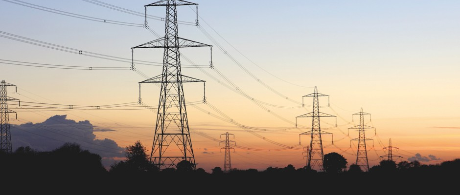
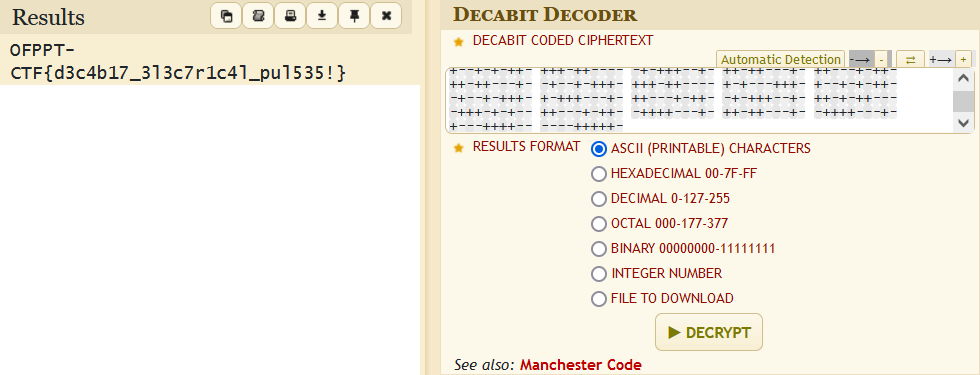

# Electrical:Steganography:500pts
I was doing some electrical work with power lines and I want to figure out how to decode relayed messages. I am lost!! Please help me decode what this means!  
  
Je faisais des travaux électriques avec des lignes électriques et je veux comprendre comment décoder les messages relayés. Je suis perdu!! S'il vous plaît, aidez-moi à décoder ce que cela signifie !  
- zip password: 0FPP7C7F  

[cipher.zip](cipher.zip)  

# Solution
指定されたパスワードでzipを解凍すると謎のtxtが出現する。  
```bash
$ cat cipher.txt
+-+---+-++ -++---+++- -+++--+-+- -+++--+-+- -+---++++- ++-+-+-+-- +--++++--- -+---++++- -++---+++- --+++++--- +---+++-+- ++-++---+- -+--+-+++- +-+++---+- ---+++-++- +--+-+-++- +++-++---- -+-+++--+- ++-++---+- ++---+-++- ++-++---+- -+--+-+++- +++-++---- +-+---+++- +--+-+-++- -+--+-+++- +-+++---+- ++---+-++- -+-+++--+- ++-+-++--- -+++-+-+-- ++---+-++- -++++---+- ++-++---+- -++++---+- +---++++-- ----+++++-
```
三ブロック目と四ブロック目が同じであるため`OFPPT-CTF{`から始まると予測できる。  
```
+-+---+-++:O
-++---+++-:F
-+++--+-+-:P
-+++--+-+-:P
-+---++++-:T
++-+-+-+--:-
+--++++---:C
-+---++++-:T
-++---+++-:F
--+++++---:{
```
しかし、`O`と`P`が離れすぎており、二進数などではないようだ。  
「CTF  electrical cipher decode」と検索すると[Decabit Code (Electricity Pulsations) - Online Decoder, Encoder](https://www.dcode.fr/decabit-code)がヒットする。  
まったく同じ暗号のようだ。  
  
デコードするとflagが得られた。  

## OFPPT-CTF{d3c4b17_3l3c7r1c4l_pul535!}