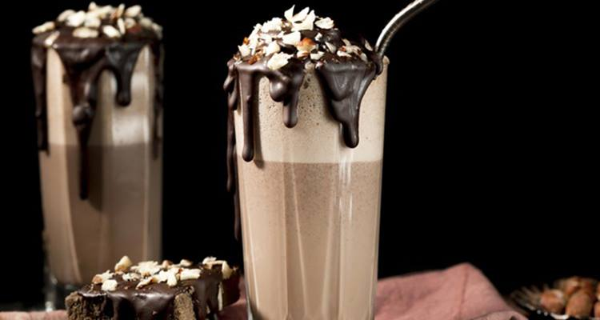
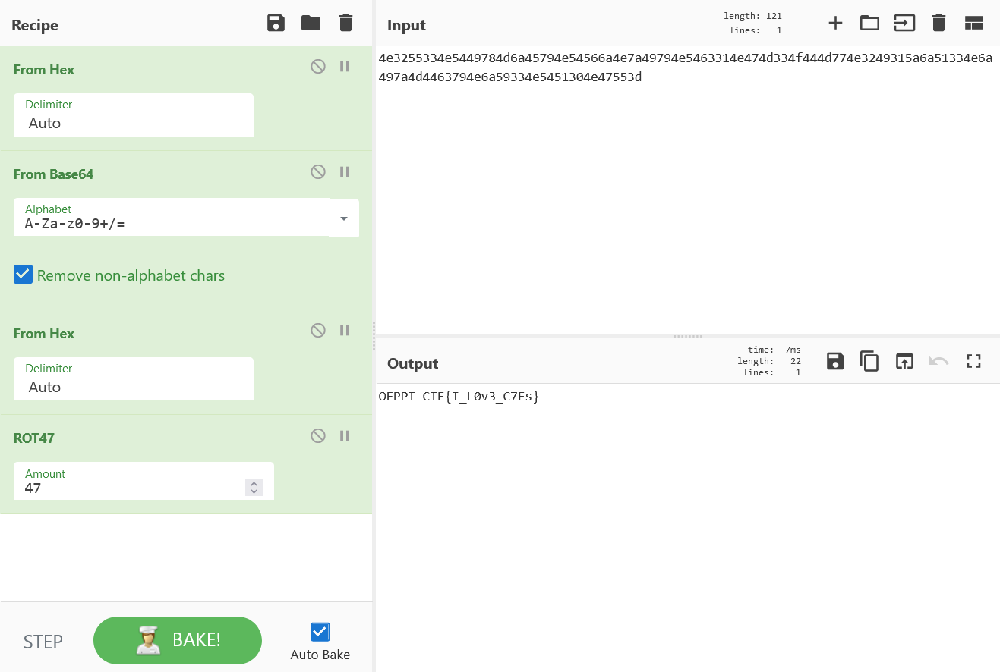

# Milkshake:Cryptography:250pts
This is a cyberchef special combo "milkshake"! Please don't hate me!  
4e3255334e5449784d6a45794e54566a4e7a49794e5463314e474d334f444d774e3249315a6a51334e6a497a4d4463794e6a59334e5451304e47553d  
  
C'est un combo "milkshake" spécial cyberchef !  
4e3255334e5449784d6a45794e54566a4e7a49794e5463314e474d334f444d774e3249315a6a51334e6a497a4d4463794e6a59334e5451304e47553d  
Hint  
[https://gchq.github.io/CyberChef/](https://gchq.github.io/CyberChef/)  
Hint  
5 steps!  

# Solution
CyberChef問題らしい。  
明らかにASCIIのhexなので戻す。  
```bash
$ python
~~~
>>> from Crypto.Util.number import long_to_bytes
>>> hex = 0x4e3255334e5449784d6a45794e54566a4e7a49794e5463314e474d334f444d774e3249315a6a51334e6a497a4d4463794e6a59334e54
51304e47553d
>>> print(long_to_bytes(hex))
b'N2U3NTIxMjEyNTVjNzIyNTc1NGM3ODMwN2I1ZjQ3NjIzMDcyNjY3NTQ0NGU='
```
base64デコードする。  
```bash
>>> from base64 import b64decode
>>> print(b64decode('N2U3NTIxMjEyNTVjNzIyNTc1NGM3ODMwN2I1ZjQ3NjIzMDcyNjY3NTQ0NGU='))
b'7e752121255c7225754c78307b5f476230726675444e'
```
またhex2ASCIIだ。  
```bash
>>> hex2 = 0x7e752121255c7225754c78307b5f476230726675444e
>>> print(long_to_bytes(hex2))
b'~u!!%\\r%uLx0{_Gb0rfuDN'
```
一見すると意味不明な文字が現れたが、`~u!!%\\r%u`は`OFPPT-CTF`であると予測できる。  
特に`!!`と`PP`や`u`が`F`に対応していることがよくわかる。  
差をとってやる。  
```bash
>>> print(ord('~')-ord('O'))
47
>>> print(ord('u')-ord('F'))
47
>>> print(ord('!')-ord('P'))
-47
>>> print(ord('%')-ord('T'))
-47
>>> print(ord('\\')-ord('-'))
47
```
+47や-47されていそうであるので、rot47を怪しむ。  
以下のように戻してやればよい。  
```bash
>>> text = "~u!!%\\r%uLx0{_Gb0rfuDN"
>>> for c in text:
...     f = ord(c) - 47
...     if f > 0x20 and f < 0x7f:
...         print(chr(f), end="")
...     else:
...         print(chr(f + 94), end="")
...
OFPPT-CTF{I_L0v3_C7Fs}
```
flagが得られた。  
CyberChefでやったほうが楽である。  
  

## OFPPT-CTF{I_L0v3_C7Fs}