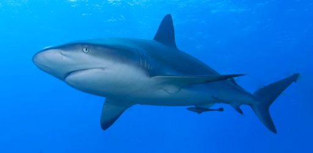
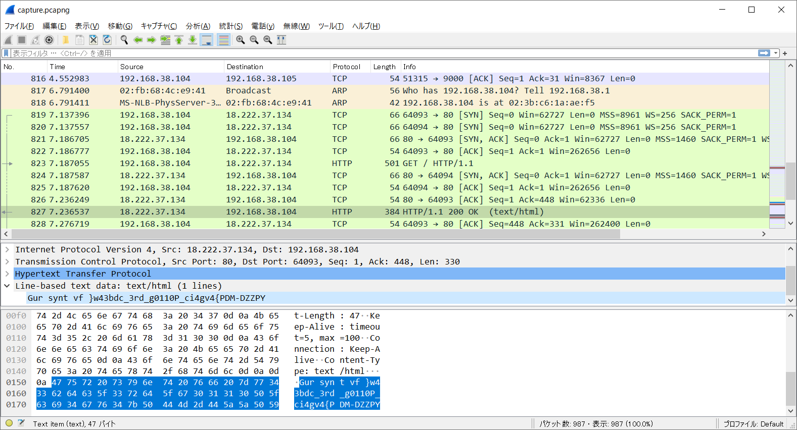

# Shark:Forensics:200pts
We managed to capture an important conversation.  
We need you to find the flag inside the pcap file.  
  
Nous avons réussi à capturer une conversation importante;  
Nous avons besoin que vous trouviez le drapeau "flag" dans le fichier pcap.  
Hint  
Wireshark is the tool!  
[capture.zip](capture.zip)  

# Solution
パスワード付き圧縮されたzipが配られる。  
パスワード解析問題かと考えるが、他問題で共通のzipパスワード`0FPP7C7F`で解凍に成功した。  
Whiresharkで解析し、HTTPを中心に見ると怪しい文字列が送られていた。  
  
`Gur synt vf }w43bdc_3rd_g0110P_ci4gv4{PDM-DZZPY`はよく見るとフラグを逆転し、文字を変化させたものに見える。  
まずはリバースし`YPZZD-MDP{4vg4ic_P0110g_dr3_cdb34w} fv tnys ruG`を得る。  
その後、[rot13.com](https://rot13.com/)で`OFPPT-CTF`になるものを探す。  
ROT16で`OFPPT-CTF{4lw4ys_F0110w_th3_str34m} vl jdoi hkW`になり、flagが得られた。  

## OFPPT-CTF{4lw4ys_F0110w_th3_str34m}