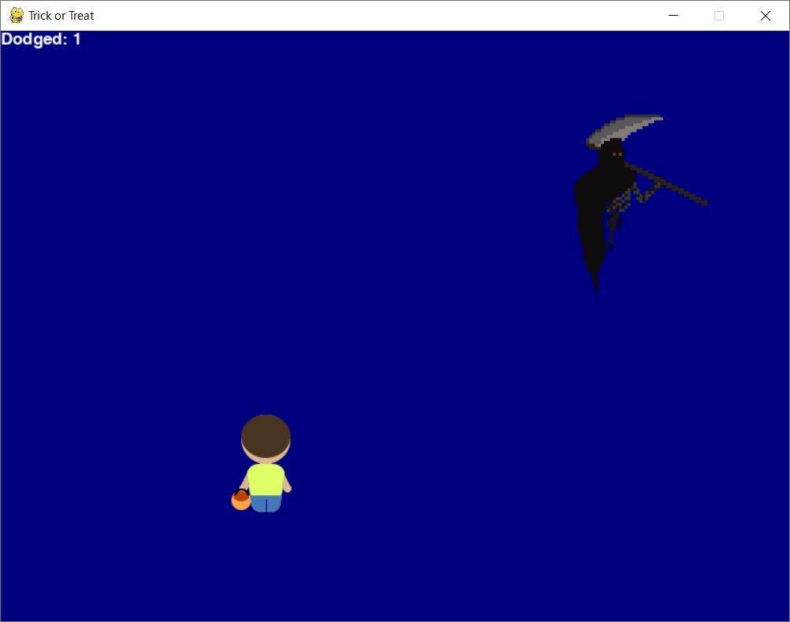
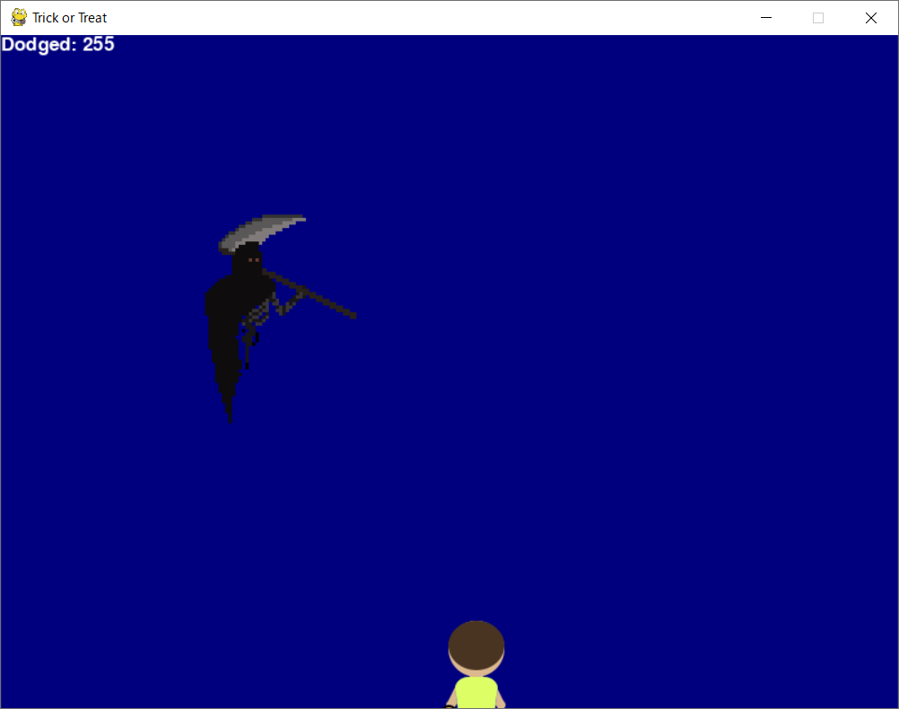

# Trickster:Exploitation:248pts
A user created a simple game in Python that he claims nobody can beat.  
Check out the game and try to find the flag hidden inside.  
  
Un utilisateur a créé un jeu simple sur Python qu'il prétend que personne ne peut battre.  
Vérifier le jeu et trouver un drapeau caché.  
Hint  
Clearly it is obfuscated!  
Hint  
Flag has format: OFPPT{...}  
[trickster.zip](trickster.zip)  

# Solution
配布されたpyファイルを実行するとGUIゲームのようだ。  
  
尖った死神が降ってきて、それにあたるとゲームオーバーになるようだ。  
躱すとポイントが1ずつ増えるが、死神が高速になる。  
コードを見てやると以下のスコア計算らしき部分が目に入る。  
```python
~~~
        if enemy.eY > game.dH:
            enemy.eY = 0 - enemy.eH
            enemy.eX = randrange(0, game.dW)
            gss += 0x1
            gf = gss
            enemy.speed += 1
            if gf > (5 * 20):
                gf = (25 * 4)
                game.pause_text = gs()
                pause = True
~~~
```
`gss += 0x1`を`gss += 0xff`に変更してゲームをする。  
  
スコアが255になり、flagがターミナルに表示されていた(一部異なったフラグ形式のものもあるようだ)。  
```bash
$ python game.py
pygame 2.1.2 (SDL 2.0.16, Python 3.8.10)
~~~
flag{
OFPPT{CaNT_ch34t_d34th}
```

## OFPPT{CaNT_ch34t_d34th}