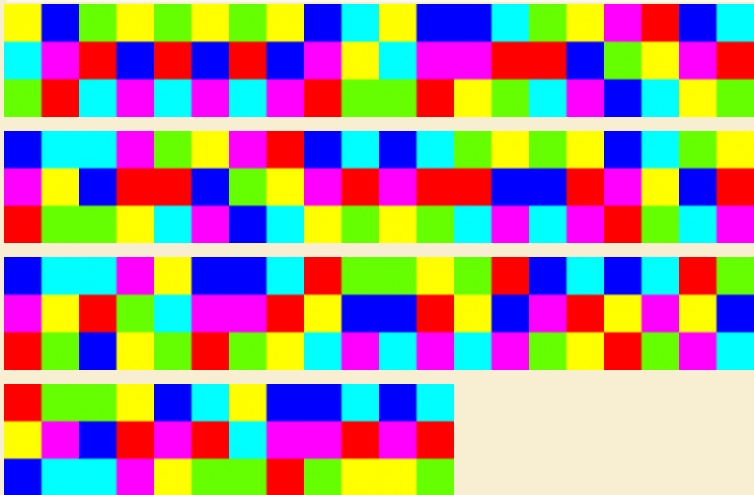
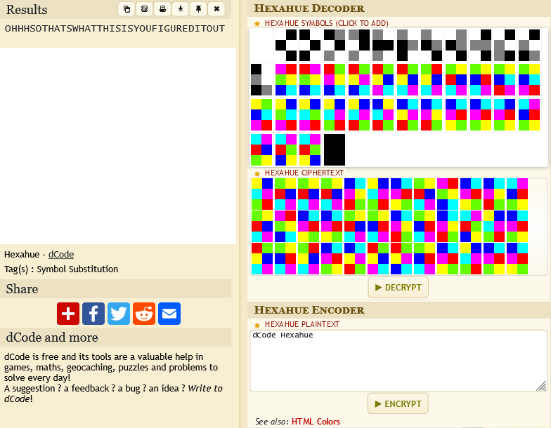

# Weird Colors:Steganography:700pts
I found these weird colors somewhere and I think that there is a hidden message behind them, help me!  
Flag Format: OFPPT-CTF{messageyouextract}  
  
J'ai trouvé ces couleurs bizarres quelque part et je pense qu'il y a un message caché derrière elles, aidez-moi !  
Format d'indicateur : OFPPT-CTF{message-à-extraire}  
- zip password: 0FPP7C7F  

[weirdscolors.zip](weirdscolors.zip)  

# Solution
指定されたパスワードでzipを解凍すると以下の画像が得られた。  
  
一瞬Pietかと思うが、どうやら違うらしい。  
ここで「CTF color pixels cipher」と画像検索すると過去のCTFwriteupにHexahueというものを発見する。  
色の構成や升目が一致している。  
Hexahueのデコーダを探すと、[Hexahue Cipher (Color Alphabet) - Online Decoder, Translator](https://www.dcode.fr/hexahue-cipher)が見つかる。  
  
配布された画像の通りに構成してやると`OHHHSOTHATSWHATTHISISYOUFIGUREDITOUT`とデコードされた。  
これを指定された形式に整形するとflagとなった。  

## OFPPT-CTF{OHHHSOTHATSWHATTHISISYOUFIGUREDITOUT}