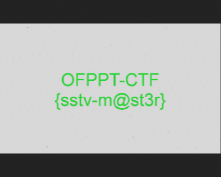

# Weird sounds:Cryptography:700pts
This weird sound is coming from my grandma's old TV, and I think it is a secret message. Can you help me decode this?  
  
Ce son bizarre vient de la vieille télé de ma grand-mère, et je pense que c'est un message secret. Pouvez-vous m'aider à décoder?  
ZIP PASSWORD: 0FPP7C7F  
[audio.zip](audio.zip)  

# Solution
指定されたパスワードでzipを解凍するとwavファイルが入っていた。  
問題文よりTVに関係するファイルということがわかる。  
「old TV CTF decode」で検索するとSSTVというものがあるようだ。  
YouTubeなどに上がっているSSTVの音声を聞いてみると配布されたものとほぼ同じであることが聞き取れる。  
デコーダを探すと[GitHub - colaclanth/sstv: SSTV Decoder](https://github.com/colaclanth/sstv)が見つかる。  
```bash
$ sstv -d weird.wav -o weird.png
[sstv] Searching for calibration header... Found!
[sstv] Detected SSTV mode Martin 1
[sstv] Decoding image...   [######################################################################################] 100%
[sstv] Drawing image data...
[sstv] ...Done!
```
実行すると画像が得られるようだ。  
  
flagが書かれていた。  

## OFPPT-CTF{sstv-m@st3r}