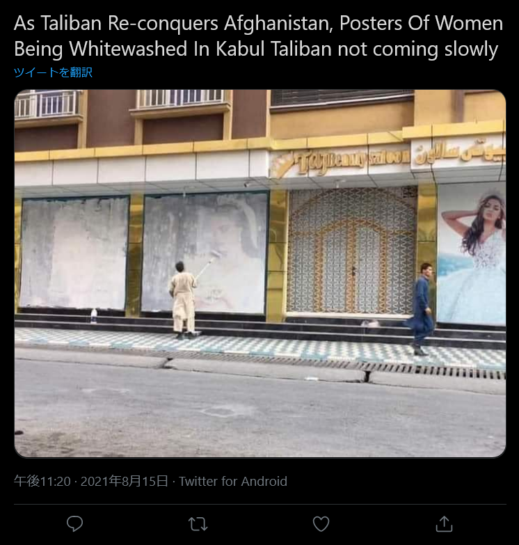
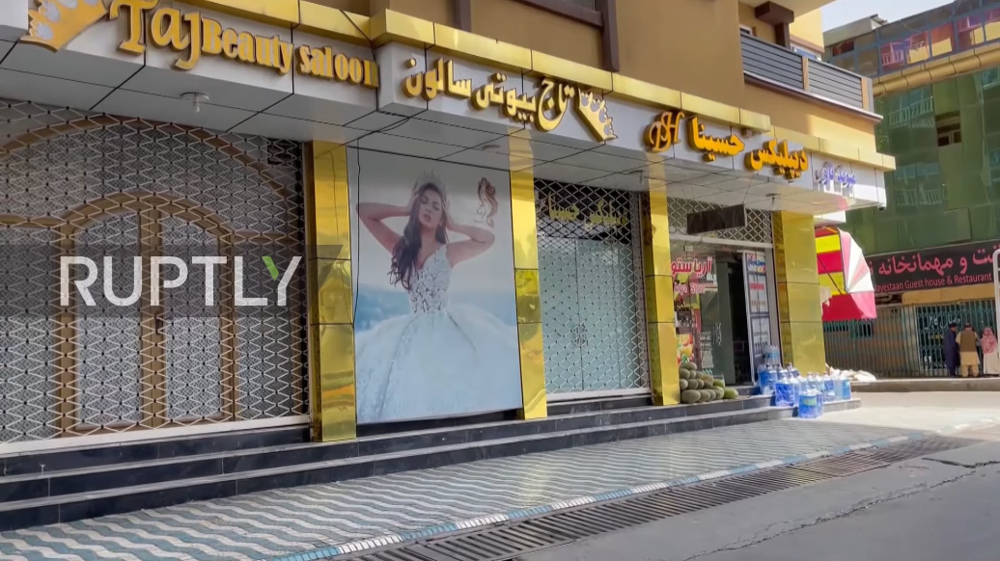
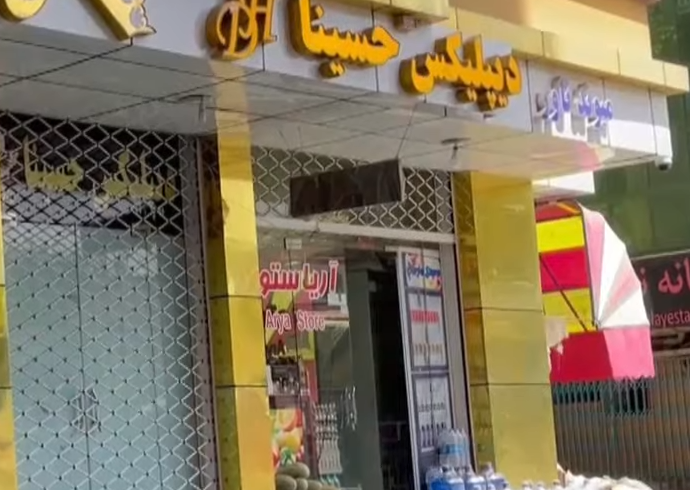

# Afganistan:PLACE:500pts
この店の２件隣にある店の名前を英語表記で答えよ  
Answer the shop's name (English) two buildings away from the shop in the picture.  
[https://twitter.com/maharrmocharo/status/1426911665161969669](https://twitter.com/maharrmocharo/status/1426911665161969669)  

# Solution
タリバンによる女性の写真に対する問題のツイートをしている。  
  
この店の2軒隣を調査すればよいようだが、まずは店がわからない。  
`taliban female white`でGoogle検索すると`Taj Beauty Salon`がヒットする。  
店名からマップで捜索するが難しいようだ。  
このツイートの元動画がないかと考え、YouTubeで`afghanistan Taj Beauty Salon`と検索する。  
[https://www.youtube.com/watch?v=kBnfIHW15do](https://www.youtube.com/watch?v=kBnfIHW15do)の1:02からの部分に同じ場所が映っている。  
  
2軒左隣の店名が写っていそうだ。  
  
拡大するとArya Storeと読み取れる。  
これがflagだった。  

## Arya Store