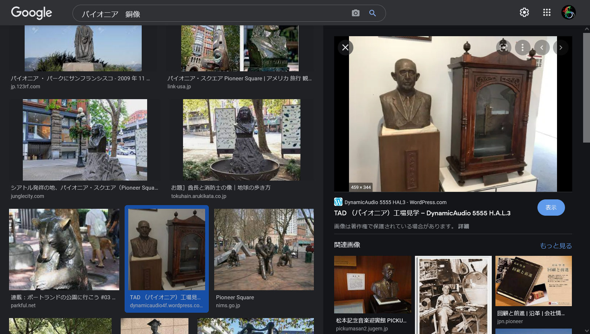
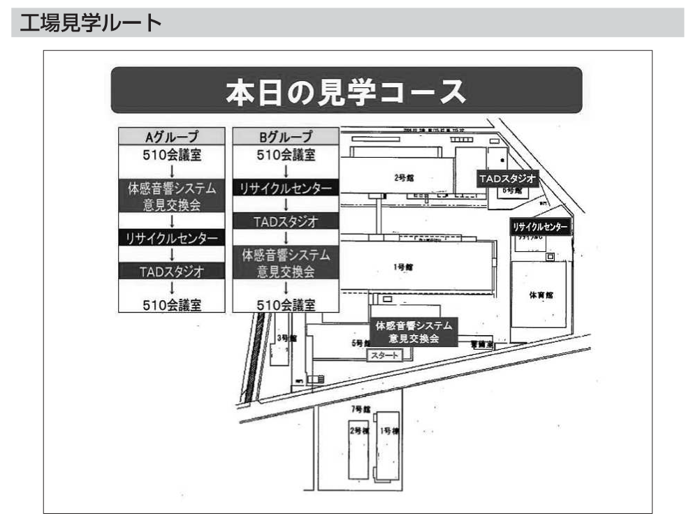

# DISK:PLACE:300pts
年代物のオルゴール。これが展示されている場所の位置を答えよ。  
A vintage music box. Answer where it is located.  
  
**フラグ形式 / FlagFormat**  
`Nxx.xxxx,Exxx.xxxx`  
[antique.jpg](antique.jpg)  

# Solution
オルゴールの場所を調査する。  
`"社是"　"社会に奉仕すること"`でGoogle検索を行うと、パイオニアであることがわかる。  
`パイオニア　銅像`でGoogle画像検索すると以下のように場所がわかる写真が出てくる。  
  
[サイト](https://dynamicaudio4f.wordpress.com/2018/07/04/tad%E3%80%80%EF%BC%88%E3%83%91%E3%82%A4%E3%82%AA%E3%83%8B%E3%82%A2%EF%BC%89%E5%B7%A5%E5%A0%B4%E8%A6%8B%E5%AD%A6/)より川越工場のメインエントランスのようだ。  
`パイオニア　川越工場　内部`と検索すると[PDF資料](https://www.pref.saitama.lg.jp/documents/57454/jireisyu-daiissyo-pioneer.pdf)が出てくる。  
  
見学コースは5号館から始まっていることから、メインエントランスはここにあると推測でき、その入り口に配置されているようだ。  
座標をGoogleMapsなどで取得してやり、指定された形式に整形すればよい。  

## N35.9320,E139.4721