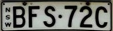
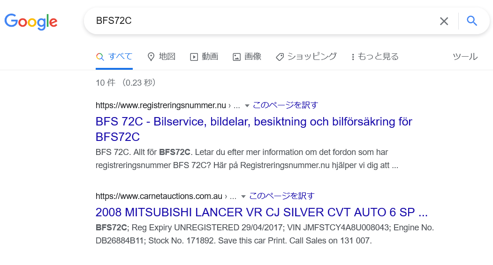

# Plate:WEB:150pts
このナンバープレートの車種を答えよ  
Answer the car model that uses this number plate.  
[bfs_72c_car_number.jpg](bfs_72c_car_number.jpg)  

# Solution
ナンバーが渡される。  
  
`BFS72C`をGoogleで調査する。  
  
二件目にそれらしきものがあるが中身は消えている。  
キャッシュを見ると`BFS72C Registration No.`との[表記がある](images/cache_np.png)ため、タイトルの車種で間違いないようだ。  
提出するとflagだった。  

## MITSUBISHI LANCER