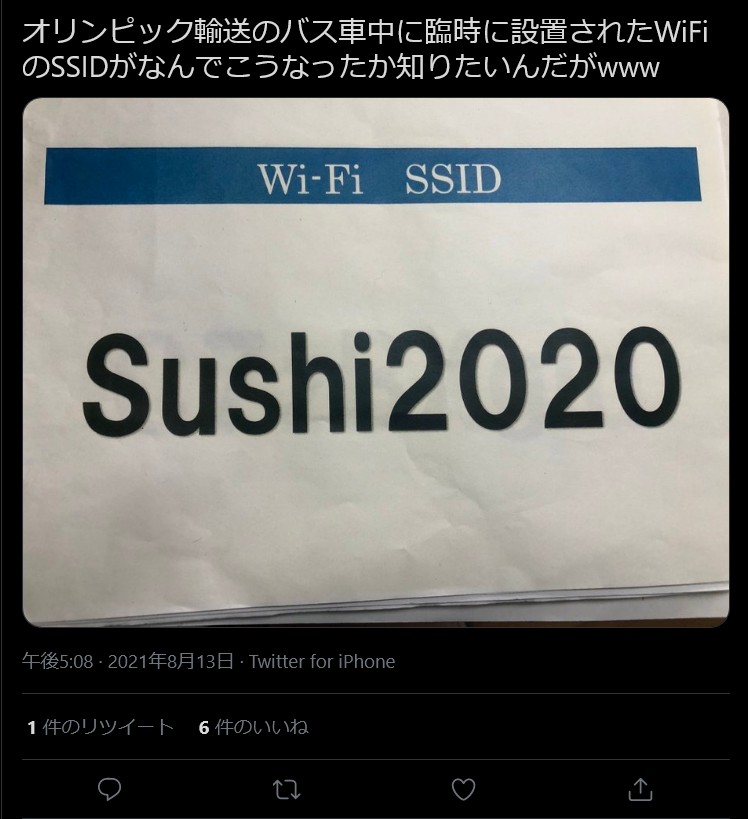
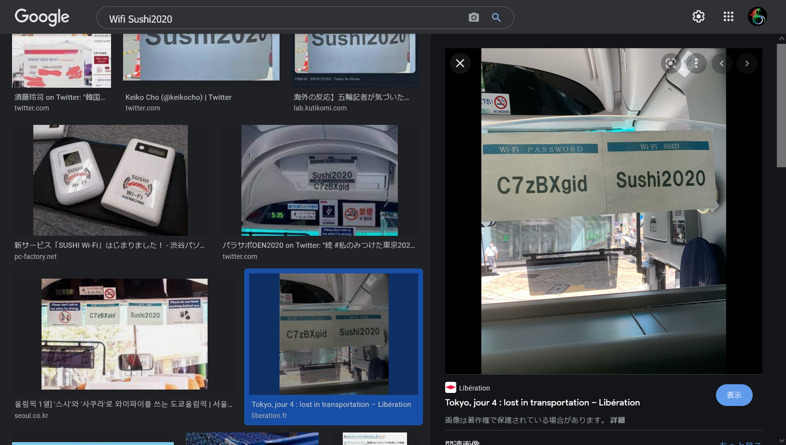

# TOKYO2020:BUS:150pts

私は東京オリンピックを取材にシンガポールから着た記者である。会場から MPC に戻るときの専用バスに乗るのであるが、バスの Wi-Fi のパスワードを教えてほしい。  
I came from Singapore to cover Tokyo Olympics. I'm going to take a shuttle bus back to MPC from the stadium, and I want to use the bus Wi-Fi. What is the Wi-Fi password?  
[tokyo2020.jpg](tokyo2020.jpg)

# Solution

バスのWi-Fiのパスワードを特定すればよいらしい。  
ツイートしている人を探そうと考え、`オリンピック バス wifi`で Twitter 検索する。  
  
[ツイート](https://twitter.com/gon_nasukko/status/1426093237517705216)より SSID が`Sushi2020`とわかる。  
Google で`Wifi Sushi2020`と画像検索すると、パスワード写真も一緒にヒットする。  
  
`C7zBXgid`のようでこれが flag だった。

## C7zBXgid