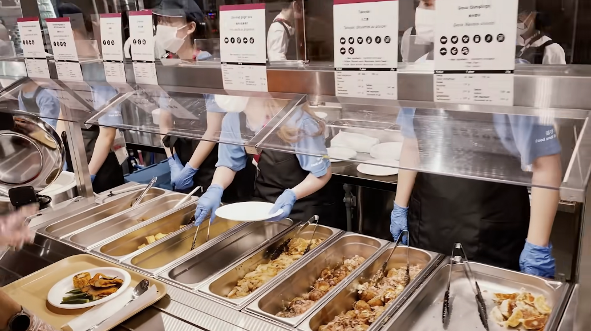

# Village:Paralympic:300pts
東京オリンピックの選手村にある食堂で並んでいるメニューの中で、焼き餃子の左隣に置かれていた料理は？  
Have you been to the dining hall at the Olympics and Paralympics village? What is the name of the dish next to the dumplings?  

# Solution
選手村の食堂のメニューを調査するようだ。  
食堂をあげている選手がいるだろうと推測し、`tokyo olympic village`でYouTubeを検索する。  
[https://www.youtube.com/watch?v=tdPHJVodepE](https://www.youtube.com/watch?v=tdPHJVodepE)の動画で順に食堂を撮っている。  
2:13からに以下のように焼き餃子が映っている。  
  
横にたこ焼きがあるのがわかる。  
flagはたこ焼きだった。  

## たこ焼き