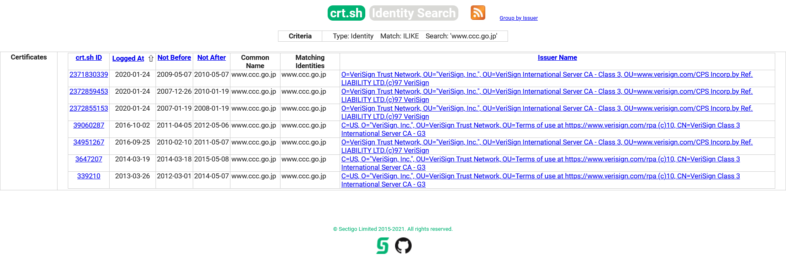

# past cetificate:WEB:100pts
日本にサイバークリーンセンター(Cyber Clean Center) という組織がありました。その組織の最後の電子証明書のシリアルナンバーを答えよ。  
There used to be an organization in Japan called Cyber Clean Center. Answer the serial number of the last issued electronic certificate.  
  
**フラグ形式 / FlagFormat**  
`xx:xx:xx:xx:xx:xx:xx:xx:xx:xx:xx:xx:xx:xx:xx:xx`  

# Solution
`サイバークリーンセンター(Cyber Clean Center)`の電子証明書を取得すればいいようだ。  
まずはドメインを調査しなければならない。  
Wikipediaの外部リンクから`https://www.ccc.go.jp/`であることがわかるが、すでに落ちている。  
[crt.sh](https://crt.sh/?q=www.ccc.go.jp)を見ると電子証明書の情報が閲覧できる。  
  
[ID:3647207](https://crt.sh/?id=3647207)からシリアルが`37:d4:64:28:16:b8:5d:b6:7d:1b:e7:55:80:b7:8c:25`とわかる。  
これがflagであった。  

## 37:d4:64:28:16:b8:5d:b6:7d:1b:e7:55:80:b7:8c:25