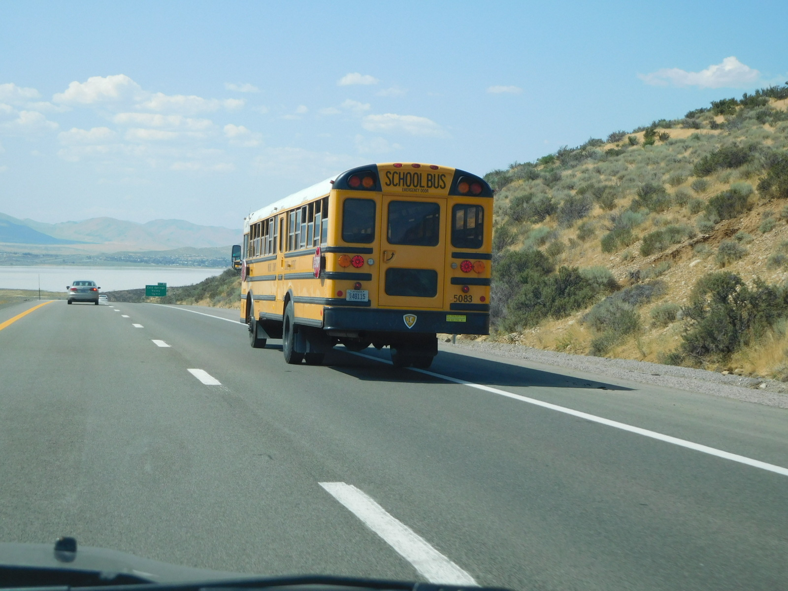

# soar to new heights:BUS:300pts
私の名前を冠した学校がようやく完成した。すでに亡くなった私には、このスクールバスに乗って学校に通う学区の子どもたちを見送ることはできない。せめて、楽しく学びの多い学生生活が送れることを空の向こうから見守っていこう。あぁ、開校式に参加してくれた妻にも思いを伝えたい。さあ、私と一緒に妻の名前を呼んでくれ（妻の名前をフルネームで答えよ）。  
A school named after me has finally opened. I can't see off the children on the school bus since I died a while ago. I hope, from the sky above, their school life will be fruitful and educative. I also want to send my love to my wife, who attended the ribbon-cutting ceremony. Please call her name with me. (answer in full name)  
[schoolbus.JPG](schoolbus.JPG)  

# Solution
バスの写真が渡される。  
  
遠くの看板を拡大すると`Cold Splings V***** V*****`と読める。  
問題文から`cold springs school opening ceremony`と検索すると以下がヒットする。  
  
人の名前を冠していそうだ。  
`Michael Inskeep`で画像検索すると[ここ](https://www.washoeschools.net/Page/16215)より偉大な故人であることがわかる。  
奥さんの名前を探すようだが、開校式に参加しているようだ。  
YouTubeで`michael inskeep elementary school`と検索すると、[この動画](https://www.youtube.com/watch?v=5Zr09_TCPo0)がヒットする。  
テープカットからもわかる通り、開校式のようだ。  
1:44に奥さんの名前が表示される部分があった。  
  
これがflagであった。  

## Geri Inskeep