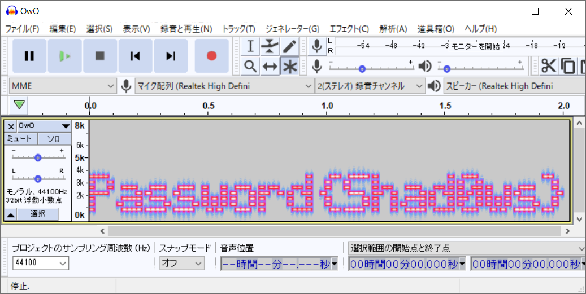
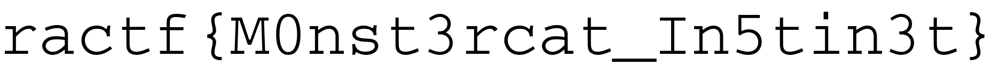

# A Monster Issue:Steg / Forensics:100pts
Agent,  
We've got a case of industrial espionage, quite an unusual one at that.
An international building contractor - Hamilton-Lowe, has written to us
that they are having their private client contracts leaked.  
After conducting initial incident response, they managed to find a hidden
directory on one of their public facing web-servers. However, the strange
thing is, instead of having any sensitive documents, it was full of mp3 music
files.  
This is a serious affair as Hamilton-Lowe constructs facilities for high-profile
clients such as the military, which means having building schematics leaked from
them could lead to a lapse in national security.  
We have attached one of these mp3 files, can you examine it and see if there
is any hidden information inside?  
[aero_chord.mp3](aero_chord.mp3)  

# Solution
aero_chord.mp3を開いてみても、曲が流れるだけである。  
洋楽は知らないのでbinwalkしてみる。  
```bash
$ binwalk -e aero_chord.mp3

DECIMAL       HEXADECIMAL     DESCRIPTION
--------------------------------------------------------------------------------
1726          0x6BE           JPEG image data, JFIF standard 1.01
5162942       0x4EC7BE        Zip archive data, at least v2.0 to extract, uncompressed size: 191624, name: OwO.wav
5252619       0x50260B        End of Zip archive

$ cd _aero_chord.mp3.extracted/
_aero_chord.mp3.extracted$ ls
4EC7BE.zip  OwO.wav
```
4EC7BE.zip(OwO.wav)とOwO.wavが得られたが進歩がない。  
OwO.wavをもう一度binwalkする。  
```bash
_aero_chord.mp3.extracted$ binwalk -e OwO.wav

DECIMAL       HEXADECIMAL     DESCRIPTION
--------------------------------------------------------------------------------
179972        0x2BF04         Zip archive data, encrypted compressed size: 11480, uncompressed size: 11854, name: flag.png
191602        0x2EC72         End of Zip archive

_aero_chord.mp3.extracted$ cd _OwO.wav.extracted/
_aero_chord.mp3.extracted/_OwO.wav.extracted$ ls
2BF04.zip  flag.png
```
2BF04.zip(flag.png)はパスワードがかかっており、flag.pngは破損している。  
OwO.wavに立ち返り、スぺクトログラムを見てやるとパスワードが書かれていた。  
  
Password(Shad0ws)なのでShad0wsで解凍するとflag.pngが得られた。
  

## ractf{M0nst3rcat_In5tin3t}