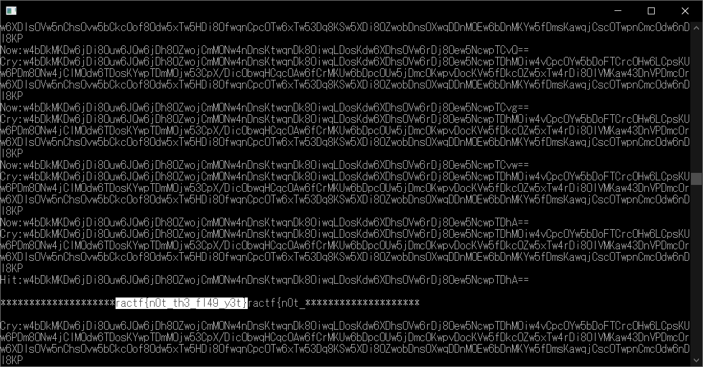
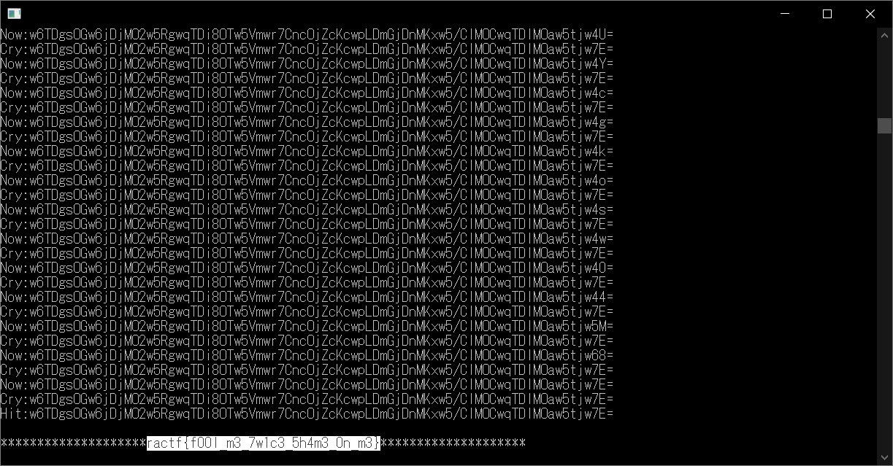

# B007L36 CRYP70... 4641N:Cryptography:400pts
Challenge instance ready at 95.216.233.106:10930.  
As you continue your pentest of MEGACORP, you make your way to an admin-only subnet of the network. There, you find yet another custom crypto implementation. You also previously found this zip file on a user's desktop. Solving this may be the last step to gaining full access to the company's network  
[encryption_service.zip](encryption_service.zip)  

# Solution
ncすると以下のように表示される。  
```bash
$ nc 95.216.233.106 10930
Welcome MEGACORP admin! Feel free to encrypt any sensitive information using this service to protect against data theft.

Please enter the secret key to encrypt the data with: a
Please enter the data that you would like to encrypt: a
Your encrypted message is: w4I=

Please enter the secret key to encrypt the data with: a
Please enter the data that you would like to encrypt: b
Your encrypted message is: w4M=

Please enter the secret key to encrypt the data with: b
Please enter the data that you would like to encrypt: a
Your encrypted message is: w4M=
```
Base64らしきもの出力されているが、keyとdataが逆でも同じ暗号になることがわかる。  
文字を何かに置き換え、足しているようだ。  
zipにはciphertext.txt、password.txt、plaintext.txtが入っているが、まずはplaintext.txtを暗号化してciphertext.txtとなるkeyを見つける。  
総当たりするのがよい。  
ractf{から始まっていそうな予感がする。  
以下のbfdec.pyで解読する。  
```python:bfdec.py
import binascii
import socket
import re

c = "w4bDkMKDw6jDi8Ouw6JQw6jDh8OZwojCmMONw4nDnsKtwqnDk8OiwqLDosKdw6XDhsOVw6rDj8Oew5NcwpTDhMOiw4vCpcOYw5bDoFTCrcOHw6LCpsKUw6PDm8ONw4jClMOdw6TDosKYwpTDmMOjw53CpX/DicObwqHCqcOAw6fCrMKUw6bDpcOUw5jDmcOKwpvDocKVw5fDkcOZw5xTw4rDi8OlVMKaw43DnVPDmcOrw6XDlsOVw5nChsOvw5bCkcOof8Odw5xTw5HDi8OfwqnCpcOTw6xTw53Dq8KSw5XDi8OZwobDnsOXwqDDnMOEw6bDnMKYw5fDmsKawqjCscOTwpnCmcOdw6nDl8KP"
p = "To test the encryption service, encrypt this file with your company issued secret key and ensure that it results in the ciphertext.txt file."

now = "ractf{"
flag = 0
s = socket.socket(socket.AF_INET, socket.SOCK_STREAM)
s.connect(('95.216.233.106', 10930))
while True:
    for i in "abcdefghijklmnopqrstuvwxyz0123456789ABCDEFGHIJKLMNOPQRSTUVWXYZ_{} ":
        s.sendall(p.encode("utf-8")+b"\n")
        _ = s.recv(1024)
        s.sendall(now.encode("utf-8")+i.encode("utf-8")+b"\n")
        data = s.recv(1024)
        a = re.search(".*: (?P<base64>.*)\S\S\S\SPlease", str(data))
        a = a.group("base64")
        print("Cry:"+c)
        print("Now:"+a)
        if (binascii.a2b_base64(c).decode("utf-8")).startswith(binascii.a2b_base64(a).decode("utf-8")):
            now += i
            print("Cry:"+c)
            print("Hit:"+a)
            print()
            print("********************"+now+"********************")
            print()
            flag = 1
            break
    if flag==0:
        print("Error")
        break
```
  
ractf{n0t_th3_fl49_y3t}とだめ出しをされた。
しかしpassword.txtのkeyがわかっており、dataとの交換法則が成り立つためdataをkeyとして復号できる。  
bfdec.pyの差分は以下になる。  
```python:bfdec.py差分
c = "w6TDgsOGw6jDjMO2w5RgwqTDi8OTw5Vmwr7CncOjZcKcwpLDmGjDnMKxw5/ClMOCwqTDlMOaw5tjw7E="
p = "ractf{n0t_th3_fl49_y3t}ractf{n0t_th3_fl49_y3t}ractf{n0t_th3_fl49_y3t}ractf{n0t_th3_fl49_y3t}ractf{n0t_th3_fl49_y3t}"
```
実行するとflagが得られる。  
  

## ractf{f00l_m3_7w1c3_5h4m3_0n_m3}