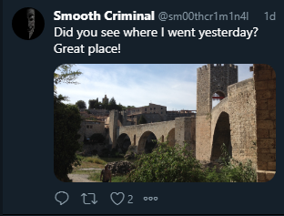

# Brick by Brick:OSINT:400pts
Wow! You're killing these! One of our social media monitoring team just sent us an urgent message. I've reproduced it below for you.  
> FROM:  
　　　　　　@　　　　　　.org  
> TO: 　　　　　　@　　　　　　.org  
> > Sorry about the Instagram account fiasco.  
> >  
> > It looks like the target still hasn't learnt radio  
> > silence, and has just created a Twitter account, with  
> > the same handle! It doesn't look especially active,  
> > but we managed to find a photo of where he was  
> > yesterday.  
> >  
> > Can you work out what town this photo was taken in?  
> >  
> > One of the other guys on the team thinks if we know  
> > where he was we should be able to track him down faster.  
> END  

As usual, we've set up the map. It should be accurate to 2km.  
  
[hires.jpg](hires.jpg)  

# Solution
OSINT問題のようだ。  
地図上の座標を特定してやればよい。  
画像検索したいが、大きすぎて画像がアップロードできないので縮小して検索する。  
romanesque bridge of besalúがヒットした。  
GoogleImages  
[Gis.png](images/Gis.png)  
Googleマップでromanesque bridge of besalúを検索して写真の位置へ移動する。  
GoogleMaps  
[Gms.png](images/Gms.png)  
42.1991252,2.701906ここのようだ。  

## 42.1991252,2.701906