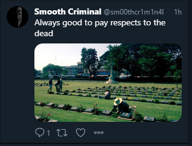

# Dead Man:OSINT:350pts
Aargh! They gave us the slip again. We got another image from their Twitter, but it doesn't look like they're in the same country anymore. Are you able to track them down again for us and tell us the town they're in? You're our best man at this point, so we're expecting great things.  
Our map here should be accurate to 500 meters.  
  
[hires.jpg](hires.jpg)  

# Solution
OSINT問題のようだ。  
地図上の座標を特定してやればよい。  
画像検索してみるが全く出てこない。  
そのため語句検索に切り替える。  
画像を拡大するとアジア圏の文字が見える。  
cross of sacrifice cemetery asiaでKanchanaburi War Cemeteryを発見できる。  
GoogleImages  
[Gis.png](images/Gis.png)  
https://en.wikipedia.org/wiki/Kanchanaburi_War_Cemetery  
GoogleマップでKanchanaburi War Cemeteryに行き十字架を見つける。  
GoogleMaps  
[Gms.png](images/Gms.png)  
14.031636,99.525013ここのようだ。  

## 14.031636,99.525013