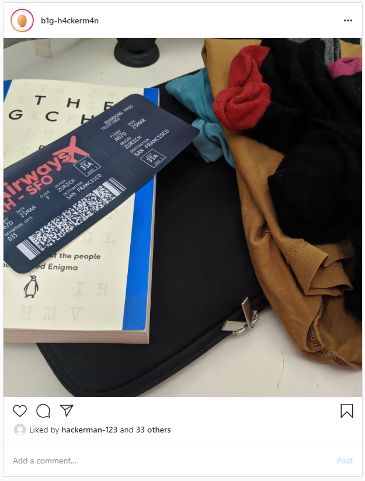

# RAirways:OSINT:200pts
Agent. We found a target posting strange images of boarding passes to his Instagram. None of the guys at base can figure it out, but we think he's been using the images to exfiltrate data. We've attached a high-quality version of the image below, here's the one from his Instagram:  
  
[original.jpg](original.jpg)  

# Solution
OSINT問題のようだ。  
フラグがどこかに隠されているようだが、明らかにバーコードが怪しい。  
しかしこのバーコードを見たことがないため、海外 バーコード 種類で検索すると以下が見つかる。  
[対応しているバーコードの種類](https://docs.grapecity.com/help/pluspak-winforms-8/GcBarCode_BarCodeType.html)  
PDF417のようだ。  
[PDF417 barcode scanner](https://play.google.com/store/apps/details?id=mobi.pdf417)で読み取るとflagが入っていた。  

## ractf{B0ard1ngP4ssD4t4}