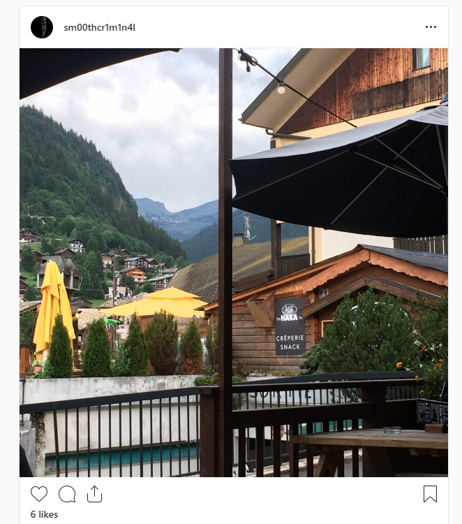
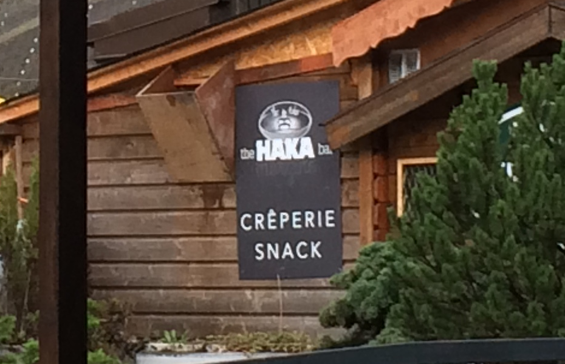

# Remote Retreat:OSINT:250pts
Agent, it's good to have you.  
One of our targets has been constantly avoiding us, but we managed to find their private Instagram. They just posted a photo, but we can't work out where they are. We tried to check the EXIF data, but it appears the social platform removes it automatically.  
Let us know where he is by clicking on the map, you'll have to be accurate to within 500 meters!  
  
[hires.jpg](hires.jpg)  

# Solution
OSINT問題のようだ。  
地図上の座標を特定してやればよい。  
まずは画像をよく見ると以下の部分が目につく。  
  
the HAKA bar CREPERIE SNACKと書かれているようだ。  
the HAKA barでGoogle画像検索を行うとそれらしき場所が出てくる。  
GoogleImages  
[Gis.png](images/Gis.png)  
The Haka Bar, Morzineがタイトルなので、それをGoogleMapsに入れる。  
GoogleMaps  
[Gms.png](images/Gms.png)  
46.181174,6.702533ここのようだ。  

## 46.181174,6.702533