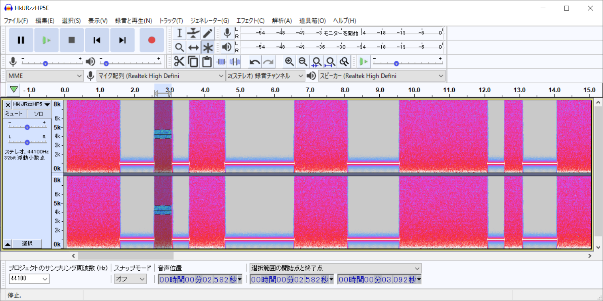

# ST.MOV:Misc:250pts
[https://youtu.be/HkIJRzzHP5E](https://youtu.be/HkIJRzzHP5E)  

# Solution
動画を見るとノイズと1kHzの音が交互に流れている。  
音声をダウンロードしてスペクトログラムを見る。  
  
0.5sを最小単位とするバイナリらしきものが見えるので書き起こす(0と1を逆にしたものも試す必要がある)。  
```text
11100101100001110001111101001100110111101111101101101001110010011001011101111100000111010011010011101101110010110000011000101101111110100111100111111101
```
100000に注意して区切り、UTF-8変換するとflagが得られる。  
```text
1110010
1100001
1100011
1110100
1100110
1111011
1110110
1101001
1100100
1100101
1101111
100000
1110100
1101001
1101101
1100101
100000
1100010
1101111
1101001
1110011
1111101

UTF-8
ractf{video time bois}
```

## ractf{video time bois}