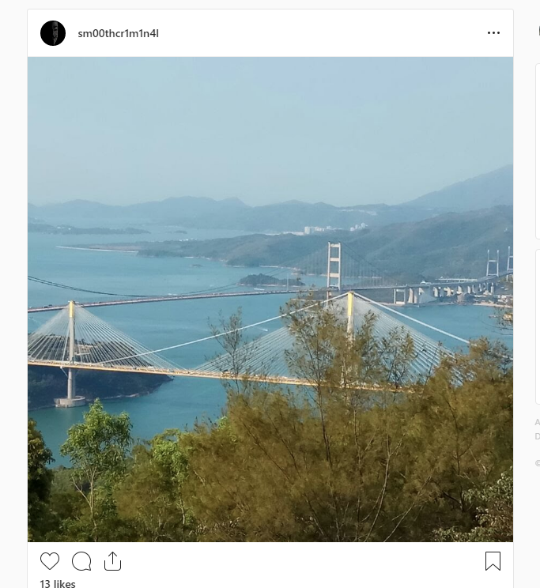

# Suspended Belief:OSINT:350pts
Amazing work with that last image! We dispatched a team right away, but it seems our target was one step ahead of us. We're not sure what they're planning, but we managed to download one final image off the Instagram account until they locked it down.  
Can you work out where this picture was taken? One of the guys thought it might have been Queensferry crossing, but that doesn't look right. You'll have to be accurate to within 2 kilometres.  
  
[hires.jpg](hires.jpg)  

# Solution
OSINT問題のようだ。  
地図上の座標を特定してやればよい。  
Google画像検索を行うと(cable-stayed bridge)と認識される。  
橋が二本あり、メインの柱のてっぺんは金色か黄色、もう一つは柱がはしご状の形をしているものを探す。  
GoogleImages  
[Gis.png](images/Gis.png)  
Ting Kau Bridgeがヒットした。  
Google画像検索やGoogleマップで確認すると正解のようだ。  
後は橋の角度を計算して、立っている位置を求めればよい。  
GoogleMaps  
[Gms.png](images/Gms.png)  
22.3726907,114.0826406ここのようだ。  

## 22.3726907,114.0826406