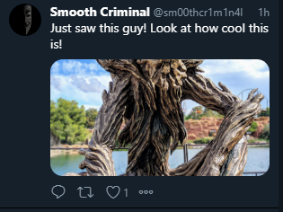

# Tree Man:OSINT:300pts
I'm so glad we've got you on the team; I don't think we'd have manged to get that last one if it weren't for you. We've been watching the account, and the target just posted another image. This guy really doesn't learn. We don't think he's left Spain yet, but we really need this one pinpointed exactly. Can you work where he took this?  
The map here should be accurate to 50 meters.  
  
[hires.png](hires.png)  

# Solution
OSINT問題のようだ。  
地図上の座標を特定してやればよいが50mとかなりシビア。  
画像検索してみるが全く出てこない。  
そのため語句検索に切り替える。  
tree man blue eyesで以下を発見できる。  
GoogleImages  
[Gis.png](images/Gis.png)  
PortAventura in HDRのようだが正確な場所がわからない。  
画像から、水辺、雑草が生えている岸、桟橋のような床であることがわかる。  
GoogleマップでPortAventura in HDRに行き航空写真を見る。  
この場所(遊園地)の近くの水辺はプールか池しかない。  
プールには雑草が生えないので池に絞ることができる。  
あとは床を探せばよい。  
GoogleMaps  
[Gms.png](images/Gms.png)  
像がないが床が一致した。  
41.0858496,1.1545298ここのようだ。  

## 41.0858496,1.1545298