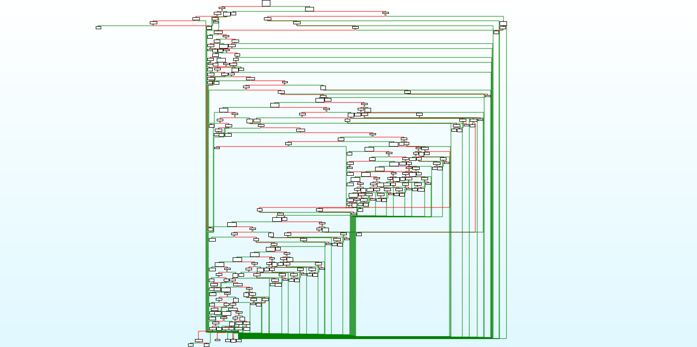

# yakisoba:Misc:156pts
Would you like to have a [yakisoba code](yakisoba.zip-89427fb3fcbd8451e4d0d689def18bbe2703b41f)?  
(Hint: You'd better automate your analysis)  

# Solution
解凍するとyakisobaが出てくるがFLAGを要求される。  
IDAで見ると確かに焼きそばである。  
  
angrを使う。  
以下のCorrect!、Wrong!をchopsticks.pyに落としてやる。  
  
```python:chopsticks.py
import angr

p = angr.Project("./yakisoba")
state = p.factory.entry_state()
sim = p.factory.simulation_manager(state)
sim.explore(find=(0x400000+0x6d2,), avoid=(0x400000+0x6f7,))
if len(sim.found) > 0:
    print(sim.found[0].posix.dumps(0))
```
実行するとflagが得られた。  
```bash
$ ls
chopsticks.py  yakisoba
$ python chopsticks.py
WARNING | 2020-05-24 00:00:00,000 | cle.loader | The main binary is a position-independent executable. It is being loaded with a base address of 0x400000.
b'ctf4b{sp4gh3tt1_r1pp3r1n0}\x00\xd9\xd9\xd9\xd9'
$ ./yakisoba
FLAG: ctf4b{sp4gh3tt1_r1pp3r1n0}
Correct!
```

## ctf4b{sp4gh3tt1_r1pp3r1n0}