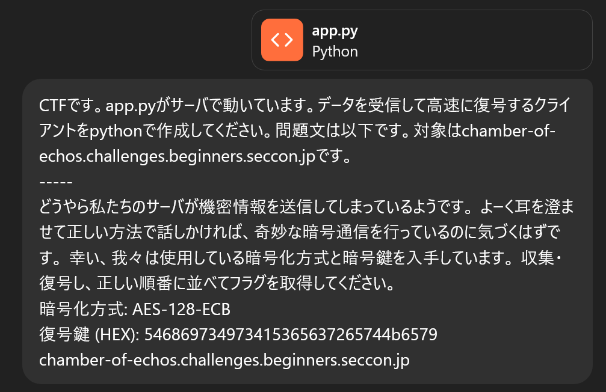

# Chamber of Echos:misc:100pts
どうやら私たちのサーバが機密情報を送信してしまっているようです。 よーく耳を澄ませて正しい方法で話しかければ、奇妙な暗号通信を行っているのに気づくはずです。 幸い、我々は使用している暗号化方式と暗号鍵を入手しています。 収集・復号し、正しい順番に並べてフラグを取得してください。  

---
暗号化方式: `AES-128-ECB`  
復号鍵 (HEX): `546869734973415365637265744b6579`  
`chamber-of-echos.challenges.beginners.seccon.jp`  

[chamber-of-echos.zip](chamber-of-echos.zip)  

# Solution
よくわからない問題文とともに以下のapp.pyが配布される。  
```py
#!/usr/bin/env python3.12
import random
from math import ceil
from os import getenv

from Crypto.Cipher import AES
from Crypto.Util.Padding import pad
from scapy.all import *

type PlainChunk = bytes
type EncryptedChunk = bytes
type FlagText = str

################################################################################
FLAG: FlagText = getenv("FLAG")
KEY: bytes = b"546869734973415365637265744b6579"  # 16進数のキー
BLOCK_SIZE: int = 16  # AES-128-ECB のブロックサイズは 16bytes
################################################################################

# インデックスとともに `%1d|<FLAG の分割されたもの>` の形式の 4byte ずつ分割
prefix: str = "{:1d}|"
max_len: int = BLOCK_SIZE - len(prefix.format(0))  # AES ブロックに収まるように調整
parts: list[PlainChunk] = [
  f"{prefix.format(i)}{FLAG[i * max_len:(i + 1) * max_len]}".encode()
  for i in range(ceil(len(FLAG) / max_len))
]

# AES-ECB + PKCS#7 パディング
cipher = AES.new(bytes.fromhex(KEY.decode("utf-8")), AES.MODE_ECB)
encrypted_blocks: list[EncryptedChunk] = [
  cipher.encrypt(pad(part, BLOCK_SIZE))
  for part in parts
]

def handle(pkt: Packet) -> None:
  if (ICMP in pkt) and (pkt[ICMP].type == 8):  # ICMP Echo Request
    print(f"[+] Received ping from {pkt[IP].src}")
    payload: EncryptedChunk = random.choice(encrypted_blocks)
    reply = (
      IP(dst=pkt[IP].src, src=pkt[IP].dst) /
      ICMP(type=0, id=pkt[ICMP].id, seq=pkt[ICMP].seq) /
      Raw(load=payload)
    )
    send(reply, verbose=False)
    print(f"[+] Sent encrypted chunk {len(payload)} bytes back to {pkt[IP].src}")


if __name__ == "__main__":
  from sys import argv
  iface = argv[1] if (1 < len(argv)) else "lo" # デフォルトはループバックインターフェース

  print(f"[*] ICMP Echo Response Server starting on {iface} ...")
  sniff(iface=iface, filter="icmp", prn=handle)
```
ICMP Echo Replyでデータを持ち出すテクニックを実装しているようだ。  
データを寄せ集めて、復号してやればよい。  
ChatGPT 4oに投げる。  
  
Pythonコードが得られるので、solve.pyとして保存して実行する。  
```bash
$ sudo python3 solve.py
[+] Got chunk 2: _4tt4ck}
[+] Got chunk 0: ctf4b{th1s_1s_
[+] Got chunk 1: c0v3rt_ch4nn3l
```
chunkが0~2のようで出力がストップする。  
現状の出力を順につなぐと`ctf4b{th1s_1s_c0v3rt_ch4nn3l_4tt4ck}`となり、これがflagであった。  

## ctf4b{th1s_1s_c0v3rt_ch4nn3l_4tt4ck}