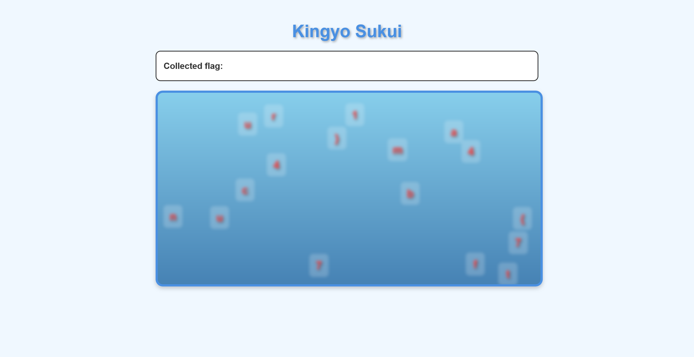
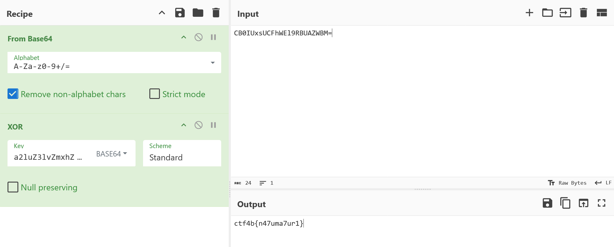

# kingyo_sukui:misc:100pts
scooping! [http://kingyo-sukui.challenges.beginners.seccon.jp:33333](http://kingyo-sukui.challenges.beginners.seccon.jp:33333)  

[kingyo_sukui.zip](kingyo_sukui.zip)  

# Solution
URLとソースファイルが配布される。  
アクセスすると、動くアルファベットを金魚すくいのように選択するゲームのようだ。  
  
サイトで動いているJavaScriptを見ると以下の通りであった。  
```js
class FlagGame {
  constructor() {
    this.encryptedFlag = "CB0IUxsUCFhWEl9RBUAZWBM=";
    this.secretKey = "a2luZ3lvZmxhZzIwMjU=";
    this.flag = this.decryptFlag();
    this.tank = document.getElementById("tank");
    this.flagContainer = document.getElementById("flag-container");
    this.collectedFlag = document.getElementById("collected-flag");
    this.resultOverlay = document.getElementById("result-overlay");
    this.resultText = document.getElementById("result-text");
    this.restartBtn = document.getElementById("restart-btn");
    this.characters = [];
    this.animationId = null;
    this.tankWidth = 0;
    this.tankHeight = 0;
    this.init();
  }
~~~
```
Base64エンコードされている`encryptedFlag`と`secretKey`が見える。  
XORだろうと予想して以下のように[CyberChef](https://gchq.github.io/CyberChef/)で復号を試みる。  
  
flagが得られた。  

## ctf4b{n47uma7ur1}